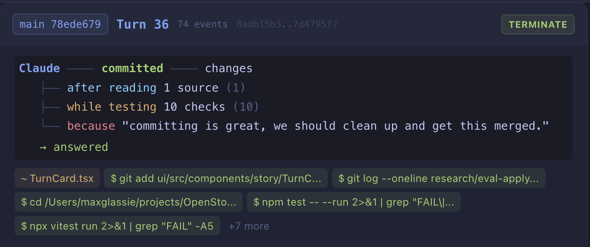
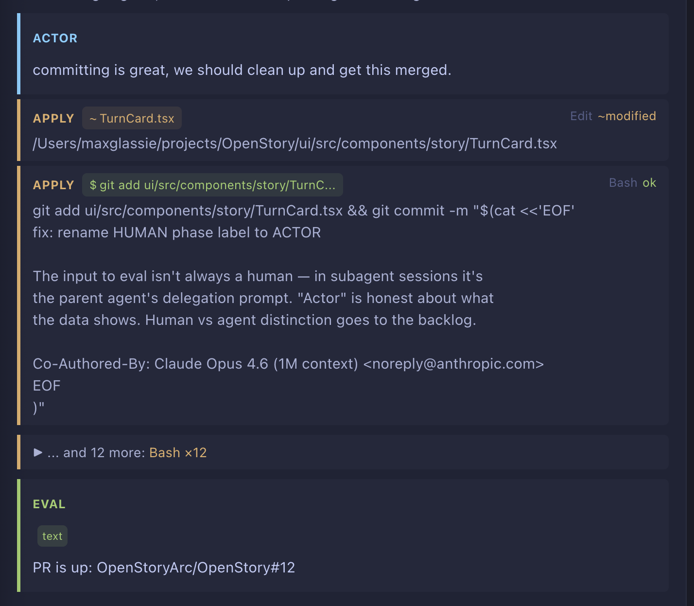
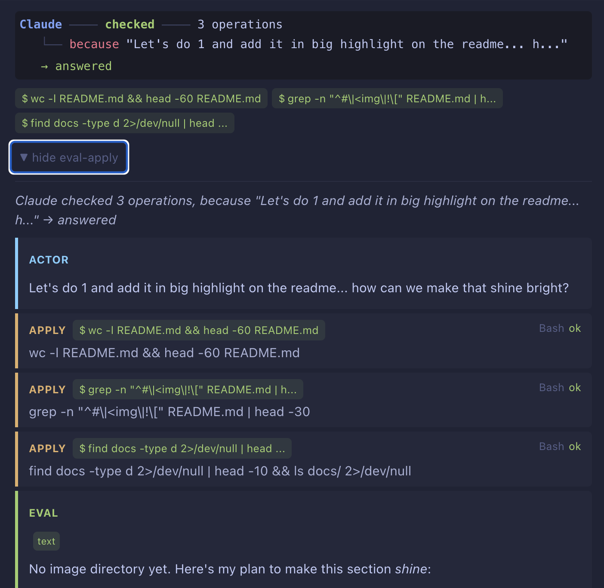

# Open Story

[](https://github.com/OpenStoryArc/OpenStory/actions/workflows/test.yml)
[](LICENSE)

Real-time observability for AI coding agents. Open Story watches what your agents do — every tool call, file edit, command, and decision — translates it into [CloudEvents 1.0](https://cloudevents.io/) via NATS JetStream, and serves a live dashboard with narrative visualization. Your data stays local, in open formats, fully portable.

> **What does this look like in practice?** **[Read the report of the session that built this feature](docs/research/sessions/06907d46-feat-story-tab-data.md)** — a 21-hour, $212, 4001-record working session, narrated entirely from data the project collected about itself, using its own scripts. *"OpenStory pointed at itself."*

```
┌─────────────────┐     ┌──────────────┐     ┌──────────────┐     ┌──────────────┐
│  Coding Agent    │────▶│  Transcript  │────▶│  Translate   │────▶│    NATS      │
│  (JSONL files)   │     │  Watcher     │     │  (CloudEvent)│     │  JetStream   │
└─────────────────┘     └──────────────┘     └──────────────┘     └──────┬───────┘
                                                                         │
                                                          ┌──────────────┼──────────────┐
                                                          │              │              │
                                                          ▼              ▼              ▼
                                                   ┌──────────┐  ┌──────────┐  ┌──────────┐
                                                   │ persist  │  │ patterns │  │broadcast │
                                                   │ consumer │  │ consumer │  │ consumer │
                                                   └────┬─────┘  └────┬─────┘  └────┬─────┘
                                                        │              │              │
                                                        ▼              ▼              ▼
                                                   ┌──────────┐  ┌──────────┐  ┌──────────┐
                                                   │  SQLite  │  │ Patterns │  │   React  │
                                                   │ + JSONL  │  │ + Turns  │  │Dashboard │
                                                   └──────────┘  └──────────┘  └──────────┘
```

## What you see

Four dashboard views, each a different lens on the same data:

**Live** — real-time event stream as your agent works. Every tool call, file read, command execution, and model response appears as it happens. Session sidebar shows all active sessions with event counts, token usage, depth sparklines, and subagent hierarchy.

**Story** — narrative view of agent work. Each turn is a card showing what Claude did and why: a sentence diagram ("Claude edited TurnCard.tsx, after reading 3 files, while testing 1 check, because 'Can we start with surfacing UUIDs?' → answered"), domain fact badges (files created/modified, commands run, searches performed), and eval-apply phase detail. Subagent delegations expand inline — click an Agent apply to see the subagent's eval-apply cycles nested recursively. The same structure at every depth.

**Explore** — historical browse and search across sessions. Full-text search, event filtering, session comparison.

**Subagent visibility** — when Claude delegates to subagents (Explore, Plan, etc.), the parent-child relationship is structural. NATS subjects encode it (`events.{project}.{session}.agent.{agent_id}`), Story cards show `main` vs `sub` badges, and inline expansion reveals the subagent's complete eval-apply cycle history.

### The Story tab — surface and depth

Each completed turn becomes a parsed English sentence:
**subject → verb → subordinates → adverbial → predicate.** One line, the
whole turn.

<p align="center">
  
</p>

> *Claude → **committed** → after reading 1 source, while running 10 checks,
> because "committing is great, we should clean up and get this merged." → answered*

Click the card and the eval-apply trace unfolds — the actor input, the tool
applications, and the model's final eval. Same turn, two abstraction layers,
both derived from the same CloudEvents:

<p align="center">
  
</p>

And sometimes the story is *itself*. Here is Open Story watching the agent
prepare this very README — three `Bash` calls inspecting the file, captured
as a sentence, while the agent's plan to "make this section *shine*" sits
inside the EVAL phase below:

<p align="center">
  
</p>

## Philosophy

Open Story is a mirror, not a leash. It observes but never interferes — it never writes back to the agent, never modifies transcripts, never blocks execution. The data is yours: CloudEvents 1.0, JSONL, Markdown. Open formats, portable, unencumbered.

**The sovereignty escape hatch:** regardless of which backend you choose (SQLite or MongoDB), every event is always appended to a per-session JSONL file in `data/`. Your data is always `grep`-able from outside the database, always portable, never locked in.

See [docs/soul/](docs/soul/) for the full philosophy, architecture narrative, and patterns we've learned building this system.

## How it works

The file watcher detects JSONL transcript changes, auto-detects the agent format (Claude Code, pi-mono, or Hermes), translates each line into CloudEvents via agent-specific translators, and publishes to NATS JetStream with hierarchical subjects (`events.{project}.{session}.agent.{agent_id}`). Four independent actor-consumers process events in parallel:

- **persist** — dedup + durable event store (SQLite default, MongoDB optional via `--features mongo`) + JSONL sovereignty backup + full-text search index
- **patterns** — eval-apply cycle detection → sentence generation → PatternEvents (2 streaming detectors: EvalApplyDetector + SentenceDetector)
- **projections** — session metadata (tokens, labels, branches, agent relationships)
- **broadcast** — CloudEvent → ViewRecord → WireRecord → WebSocket to UI

The pipeline is a **fuzzy pipe**: events with unknown subtypes flow through as SystemEvent passthroughs rather than being silently dropped. Runtime envelope schema validation classifies events into three tiers — full enrichment (known subtypes), passthrough (valid envelope, unknown content), or broken (below the sovereignty floor). See `schemas/cloud_event_envelope.schema.json` for the minimum viable CloudEvent contract.

Each actor is an independent tokio task with its own state and NATS subscription. No shared locks between actors — if pattern detection is slow, persistence and broadcast continue unblocked. NATS JetStream provides durable delivery, replay on restart, and hierarchical subject filtering. `just up` starts NATS automatically; `nats.conf` at the project root configures JetStream with 8MB max payload for large sessions.

### The eval-apply model

Agent sessions have recursive structure. A **turn** (one human prompt → complete response) contains multiple **eval-apply cycles** — each cycle is the model evaluating what it knows, dispatching tools, and processing results. Subagents spawned via the Agent tool have the same recursive cycle structure, just nested one level deeper.

The Story tab renders this as paragraphs (turns) containing sentences (cycles). Subagent work nests inside parent turns. The same `CycleCard` component renders at every depth — it's the recursive visual unit of agent work.

### Multi-agent support

Open Story observes multiple coding agents simultaneously. Each agent has its own translator and watch directory. The `agent` field on every CloudEvent identifies the source platform:

- **`claude-code`** — Claude Code sessions from `~/.claude/projects/`
- **`pi-mono`** — pi-mono (OpenClaw) sessions from `~/.pi/agent/sessions/`
- **`hermes`** — Hermes agent sessions

Format detection is automatic (per-file, based on the first JSONL line). Pi-mono bundles multiple content blocks per line (`[thinking, text, toolCall]`); the translator decomposes these into N CloudEvents and synthesizes `system.turn.complete` boundaries from `stopReason` so the sentence detector can narrate pi-mono sessions. All agents' sessions appear in the same dashboard with full sentence rendering.

### Schema registry

Every serialization boundary has a committed JSON Schema at `/schemas/`. The schemas are **generated from the Rust types** (`open-story-schemas` crate) — they're artifacts, not hand-authored. Drift is caught by test: regenerate and diff.

```
schemas/
├── cloud_event.schema.json          — full CloudEvent envelope + AgentPayload variants
├── cloud_event_envelope.schema.json — minimum viable (id + type + time + data.raw)
├── view_record.schema.json          — BFF output (13 RecordBody variants)
├── wire_record.schema.json          — WebSocket payload (ViewRecord + tree metadata)
├── broadcast_message.schema.json    — WS envelope (3 message kinds)
├── subtype.schema.json              — closed enum of 21 event subtypes
├── pattern_event.schema.json        — detected behavioral patterns
├── structural_turn.schema.json      — eval-apply turn data
├── ingest_batch.schema.json         — NATS message envelope
├── session_row.schema.json          — session list entry
└── fts_search_result.schema.json    — full-text search result
```

The `Subtype` enum in `open-story-core` is the typed source of truth for the 21 event subtypes (`message.user.prompt`, `message.assistant.tool_use`, etc.). Dogfood-validated against live production data.

### Principle tests

Four auditable principles from `CLAUDE.md` have executable test guards:

| Principle | Test | What it checks |
|-----------|------|----------------|
| Observe, never interfere | `test_principle_observe_never_interfere` | No write operations on watch_dir paths in production code |
| Functional purity | `test_principle_functional_purity` | No filesystem/network I/O in 20 declared-pure modules |
| Actor isolation | `test_principle_actor_isolation` | No cross-actor imports in consumer modules |
| Recursive observability | `test_principle_recursive_observability` | OpenStory produces legible sentences for its own development sessions |

Run with `cargo test --test test_principle_observe_never_interfere` (etc.) or `-- --ignored` for the live-data recursion test.

### For agents: using OpenStory

Agents working on this project (or any project with OpenStory running) should use the API to understand session context. From experience building this system, here's what works best:

**REST API is your primary tool.** Fast, structured, reliable:
```
GET /api/sessions                                  — list all sessions with metadata
GET /api/sessions/{id}/records                     — all events for a session
GET /api/sessions/{id}/patterns?type=turn.sentence — narrative turns with sentence diagrams
GET /api/search?q=...                              — full-text search across events
```

**Patterns API for narrative understanding.** The `turn.sentence` patterns carry the sentence diagram (verb/object/subordinates), domain facts (files touched, commands run), eval-apply phases, and subagent delegations. Use this to understand WHAT happened, not just the raw events.

**Records API for ground truth.** When you need the actual tool output, file contents, or exact sequence of events, fetch the records. The `extractCycles()` function in `ui/src/lib/eval-apply.ts` derives eval-apply cycles from records — same structure at every depth (main agent and subagents).

**Scripts for data science.** `scripts/analyze_eval_apply_shape.py --all` maps the structural shape of every session. `scripts/query_store.py` inspects SQLite directly. Write scripts for questions — don't guess.

**Avoid raw JSONL grep.** The raw transcript files are Claude Code's native format, not CloudEvents. The translate layer adds `agent_payload`, `tool_outcome`, `agent_id`. Always query through the API to get the translated, typed data.

**Avoid direct SQLite JSON queries.** The internal serde structure (`AgentPayload` with `#[serde(tag = "_variant")]`) makes JSON path queries brittle. Use the API.

### Deployed agent observability (OpenClaw)

Open Story can observe autonomous agents running in containers. The `docker-compose.openclaw.yml` defines a split deployment:

```
claude-runner ──transcripts──► listener (publisher) ──NATS──► consumer (API/dashboard)
```

The listener runs as root (to read Claude's mode-600 transcript files), watches the shared volume, translates events, and publishes to NATS. The consumer runs separately with its own data volume, subscribes from NATS, and serves the dashboard. Start with:

```bash
docker compose -f docker-compose.openclaw.yml up -d
```

See `docker-compose.openclaw.yml` for full setup including API key configuration and volume management.

## Quick Start

Requires:
- [Rust](https://rustup.rs/) (stable, edition 2021)
- [Node.js](https://nodejs.org/) 20+
- [NATS Server](https://nats.io/) — `brew install nats-server` (event bus — strongly preferred, see below)
- [just](https://github.com/casey/just) — command runner (recommended)
- [Docker](https://docker.com/) or [Podman](https://podman.io/) — for E2E/container tests only

> **Why NATS is strongly preferred.** Open Story is a *reactive* system: four
> independent actor-consumers (persist, patterns, projections, broadcast) each
> own one responsibility and subscribe to the same `events.>` stream. That
> decomposition is what makes the dashboard feel live, what lets pattern
> detection run unblocked while persistence is slow, and what gives you
> JetStream replay on restart. Without NATS, Open Story falls back to a
> single inline pipeline suitable for a quick demo — it still works, but
> the reactive actor model is collapsed into one synchronous path and you
> lose durable replay, distributed deployments, and the clean boundaries
> that make the system auditable.

### With `openstory` command

For a `code .`-style experience, copy the launcher script to your PATH:

```bash
cp scripts/openstory ~/.local/bin/openstory
chmod +x ~/.local/bin/openstory
# Edit OPEN_STORY_ROOT in the script to match your checkout location
```

Then from any project directory:

```bash
openstory .          # Start server + UI, watching the current directory
openstory            # Start with default watch dir (~/.claude/projects/)
openstory stop       # Kill server + UI
openstory test       # Run all tests
```

### With `just` (recommended)

```bash
just up          # Start NATS + server + UI (Ctrl+C to stop)
just test        # Run all tests (Rust + UI)
```

### Manual setup

```bash
# 1. Start NATS JetStream
nats-server -c nats.conf &

# 2. Build and run the server
cd rs
cargo build --release -p open-story-cli
cargo run -p open-story-cli -- serve

# 3. Start the UI dev server (in another terminal)
cd ui
npm install
npm run dev
```

The server starts on `http://localhost:3002` and watches `~/.claude/projects/` for transcript files. The UI dev server runs on `http://localhost:5173` and proxies API requests to the server.

### Watch pi-mono sessions (optional)

Open Story can observe multiple coding agents simultaneously. To add pi-mono alongside Claude Code, set the watch directory:

```bash
# Via environment variable
OPEN_STORY_PI_WATCH_DIR=~/.pi/agent/sessions just up

# Or add to data/config.toml
# pi_watch_dir = "/Users/you/.pi/agent/sessions"
```

Both watchers run simultaneously — sessions from all configured coding agents appear in the same dashboard. Format detection is automatic (per-file, based on the first JSONL line). Each event carries an `agent` field identifying its source.

### Watch Hermes sessions (optional)

```bash
OPEN_STORY_HERMES_WATCH_DIR=/path/to/hermes/sessions just up
# Or add to data/config.toml:
# hermes_watch_dir = "/path/to/hermes/sessions"
```

### MongoDB backend (optional)

SQLite is the default. For distributed or high-volume deployments, switch to MongoDB:

```bash
# Build with mongo support
cd rs && cargo build --release -p open-story-cli --features mongo

# Configure
export OPEN_STORY_DATA_BACKEND=mongo
export OPEN_STORY_MONGO_URI=mongodb://localhost:27017
export OPEN_STORY_MONGO_DB=openstory

# Or add to data/config.toml:
# data_backend = "mongo"
# mongo_uri = "mongodb://localhost:27017"
# mongo_db = "openstory"
```

Both backends implement the same `EventStore` trait — the conformance suite (94 tests) runs against both.

### With Docker/Podman

Run the full stack (server + UI + NATS) in containers:

```bash
docker compose up        # or: podman compose up
```

This starts NATS on `:4222`/`:8222`, the server on `:3002`, and the UI on `:5173`. The server watches `~/.claude/projects/` (mounted read-only).

**Container runtime:** [Podman](https://podman.io/) is recommended on Windows — it's a drop-in Docker replacement that runs on WSL2 without Docker Desktop. Install with `winget install RedHat.Podman`, then `podman machine init --rootful && podman machine start`. Existing Dockerfiles and docker-compose files work as-is.

### Event ingestion

Events arrive via the **file watcher** — the primary and only ingestion path. The watcher polls transcript directories for JSONL changes and translates them into CloudEvents. No additional configuration needed beyond setting the watch directory.

> **Note:** An HTTP `/hooks` endpoint existed in earlier versions for near-real-time Claude Code event delivery. It was retired — the file watcher provides sufficient coverage. If you have `hooks` configured in `~/.claude/settings.json` pointing at `localhost:3002/hooks`, they will receive 404s and fail silently (non-blocking). Remove them if present.

### Verify it works

```bash
# Check the server is running
curl http://localhost:3002/api/sessions

# Start a Claude Code session — events should appear in the dashboard
claude
```

## Keyboard Navigation

The dashboard supports full keyboard navigation across panels.

### Live tab

| Key | Sidebar (sessions) | Timeline (events) |
|-----|--------------------|--------------------|
| `↑` / `↓` | Move between sessions | Move between event cards (skips turn dividers) |
| `→` | Jump focus to timeline | — |
| `←` | — | Jump focus to sidebar |
| `Enter` | Select highlighted session | Open selected card in Explore |
| Click | Select session + start keyboard nav | Select card + start keyboard nav |

Only the focused panel shows the selection ring. Your position is remembered when switching between panels.

### Explore tab

| Key | Sidebar (turns/facets) | Event list |
|-----|------------------------|------------|
| `↑` / `↓` | — | Move between event cards |
| `→` | Jump focus to event list | — |
| `←` | — | Jump focus to sidebar |
| Click | — | Select card + expand/collapse |

### Cross-linking

- **Explore ↗** button on each Live card deep-links directly to that event in the Explore view
- **Enter** on a selected Live card does the same thing via keyboard

## CLI Reference

```
open-story serve [OPTIONS]     Start the dashboard server (default)
  --host <HOST>                  Bind address [default: 0.0.0.0]
  --port <PORT>                  Listen port [default: 3002]
  --data-dir <DIR>               Session persistence directory [default: ./data]
  --static-dir <DIR>             Built UI static files directory
  --watch-dir <DIR>              Transcript watch directory [default: ~/.claude/projects/]

open-story watch [OPTIONS]     Watch transcripts, emit CloudEvents to stdout
  --watch-dir <DIR>              Directory to watch [default: ~/.claude/projects/]
  --output <FILE>                Output file (JSONL append)
  --backfill                     Process existing files before watching
  --quiet                        Suppress stdout output

open-story synopsis <SESSION_ID> Show session synopsis (goal, journey, outcome)
  --data-dir <DIR>               Session data directory [default: ./data]
  --format <FMT>                 Output format: text or json [default: text]

open-story pulse [OPTIONS]     Project activity over N days
  --days <N>                     Number of days to look back [default: 7]
  --data-dir <DIR>               Session data directory [default: ./data]
  --format <FMT>                 Output format: text or json [default: text]

open-story context <PROJECT>   Recent sessions for a project
  --data-dir <DIR>               Session data directory [default: ./data]
  --format <FMT>                 Output format: text or json [default: text]

open-story backfill [OPTIONS]  Embed existing events into Qdrant for semantic search
  --data-dir <DIR>               Session data directory [default: ./data]
```

## API Endpoints

| Method | Path | Description |
|--------|------|-------------|
| GET | `/api/sessions` | List all sessions |
| GET | `/api/sessions/{id}/events` | Raw CloudEvents for a session |
| GET | `/api/sessions/{id}/events/{event_id}/content` | Full content for a truncated event |
| GET | `/api/sessions/{id}/view-records` | Typed ViewRecords for a session |
| GET | `/api/sessions/{id}/records` | WireRecords from projections |
| GET | `/api/sessions/{id}/summary` | Session summary analytics |
| GET | `/api/sessions/{id}/activity` | Activity timeline |
| GET | `/api/sessions/{id}/tools` | Tool usage distribution |
| GET | `/api/sessions/{id}/transcript` | Reconstructed conversation |
| GET | `/api/sessions/{id}/conversation` | Structured conversation view |
| GET | `/api/sessions/{id}/file-changes` | File change history |
| GET | `/api/sessions/{id}/patterns` | Detected behavioral patterns |
| GET | `/api/sessions/{id}/plans` | Plans for a session |
| GET | `/api/sessions/{id}/meta` | Session metadata |
| GET | `/api/plans` | List all plans |
| GET | `/api/plans/{id}` | Get a specific plan |
| GET | `/api/tool-schemas` | Tool schema definitions |
| GET | `/api/sessions/{id}/turns` | Eval-apply structural turns |
| GET | `/api/insights/token-usage` | Token usage summary across sessions |
| GET | `/api/insights/token-usage/daily` | Daily token usage trends |
| GET | `/api/search?q=` | Semantic search over events |
| GET | `/api/agent/search?q=` | Session-grouped semantic search (agentic) |
| GET | `/api/agent/tools` | Agent tool definitions (MCP-style) |
| GET | `/api/agent/project-context?project=` | Recent sessions for a project |
| GET | `/api/agent/recent-files?project=` | Files modified in recent sessions |
| GET | `/api/sessions/{id}/synopsis` | Session synopsis (goal, journey, outcome) |
| GET | `/api/sessions/{id}/tool-journey` | Sequence of tools used |
| GET | `/api/sessions/{id}/file-impact` | Files read vs written |
| GET | `/api/sessions/{id}/errors` | Session errors with timestamps |
| GET | `/api/insights/pulse?days=` | Project activity over N days |
| GET | `/api/insights/tool-evolution` | Tool usage evolution across sessions |
| GET | `/api/insights/efficiency` | Session efficiency insights |
| GET | `/api/insights/productivity?days=` | Event density by hour of day |
| DELETE | `/api/sessions/{id}` | Delete a session |
| GET | `/api/sessions/{id}/export` | Export session as JSONL |
| GET | `/ws` | WebSocket for live event streaming |

## Project Layout

```
open-story/
├── rs/                          Rust workspace (9 crates)
│   ├── core/                    open-story-core (CloudEvent types, translators, Subtype enum)
│   ├── bus/                     open-story-bus (NATS JetStream event bus)
│   ├── store/                   open-story-store (persistence, projection, FTS5 search)
│   ├── views/                   open-story-views (BFF: CloudEvent → ViewRecord, runtime schema validation)
│   ├── patterns/                open-story-patterns (eval-apply + sentence detection)
│   ├── schemas/                 open-story-schemas (JSON Schema generation, drift tests, dogfood)
│   ├── server/                  open-story-server (HTTP/WS, API, consumer actors)
│   ├── src/                     open-story lib (watcher + server orchestration, workspace root)
│   ├── cli/                     open-story-cli binary (thin CLI wrapper)
│   └── tests/                   Integration + principle tests
├── schemas/                     Committed JSON Schema files (11 — source of truth)
├── ui/                          React dashboard
│   ├── src/
│   │   ├── streams/             RxJS observable state management
│   │   ├── components/          React components
│   │   └── hooks/               Custom React hooks
│   └── ...
├── scripts/                     Analysis tools and data exploration
├── docs/                        Stories, backlog, and architecture docs
└── e2e/                         Playwright E2E tests
```

## Scripts

`scripts/` is a working library of Python tools for inspecting OpenStory data. They hit the REST API or read SQLite directly, and exist so questions can be answered with reproducible queries instead of one-off shell commands. Most have a `--test` flag and a clear `Usage:` header.

**Tell the story of a session** (the entry point — start here):

```bash
python3 scripts/sessionstory.py SESSION_ID            # markdown fact sheet
python3 scripts/sessionstory.py latest                # most recent session
python3 scripts/sessionstory.py SESSION_ID --json     # machine-readable
python3 scripts/sessionstory.py SESSION_ID --unfinished  # + trailing assistant messages
python3 scripts/sessionstory.py --list                # recent sessions
python3 scripts/sessionstory.py --test                # self-tests
```

`sessionstory.py` collects deterministic facts (record types, tool histogram, patterns, prompt timeline, sample sentences from the `turn.sentence` detector) and emits a structured fact sheet. It does not narrate — narration is the agent's job. There's a Claude Code skill at `.claude/skills/sessionstory/` that documents the full workflow.

**Analyze session structure:**

| Script | What it shows |
|---|---|
| `analyze_eval_apply_shape.py --session SID` | Eval-apply cycle counts, with-tools vs terminal, tools per cycle |
| `analyze_turn_shapes.py SID` | Distinct turn shapes + probability classes (multi_eval_apply, with_thinking, parallel_tools, …) |
| `analyze_event_groups.py --session SID` | Per-prompt event windows, phase distribution, common tool sequences, tool runs |
| `analyze_session_hierarchy.py` | Main vs subagent linking — how agent sessions relate to parents |
| `analyze_payload_sizes.py` | Truncation impact across sessions |
| `analyze_plan_events.py` | Where ExitPlanMode events live (main / subagent / hooks) |

**Cost and tokens:**

| Script | What it shows |
|---|---|
| `token_usage.py --session-id SID` | Input / output / cache tokens + estimated cost |
| `token_usage.py --by-session` | Per-session breakdown |
| `token_usage.py --by-day` | Daily trend |

**Direct queries:**

| Script | What it does |
|---|---|
| `query_store.py` | SQL queries over the live SQLite store (sessions, events, patterns) |
| `query_session.py` | Single-session record fetch + filter |
| `session_conversation.py SID` | Reconstruct user/assistant/tool flow in reading order |
| `event_viewer.py` | Live pretty-printer for the event log |

**Data and tooling:**

- `scrub_check.py` — flag potential secrets in fixture data
- `story_html.py` — render a session as a static HTML story
- `synth_transcripts.py` — generate synthetic transcript fixtures for tests
- `translate_pi_mono.py` — translator prototype for pi-mono format
- `load_transcripts.py` — bulk load JSONL into SQLite
- `prototype_event_graph.py` — graph-layout exploration (matplotlib)
- `explore.ipynb` — Jupyter notebook scratchpad

**Conventions:** scripts use stdlib only where possible (`urllib.request`, `sqlite3`, `argparse`). Scripts with `--test` self-validate against synthetic fixtures or a running server. New scripts should follow the same shape: docstring `Usage:` header, dataclasses for structured output, pure functions for the core logic, side effects at the edges.

See also: `docs/research/sessions/` for example reports built from these scripts, and `docs/research/scheme/daystory.sh` for the day-scoped narration companion.

## Development Commands

Run `just` to see all available commands. Key ones:

| Command | Description |
|---------|-------------|
| `just up` | Start NATS + server + UI (Ctrl+C to stop) |
| `just nats` | Start NATS JetStream standalone |
| `just nats-stop` | Stop NATS |
| `just test` | Run all tests (Rust + UI) |
| `just test-rs` | Run Rust tests only |
| `just test-ui` | Run UI tests only |
| `just e2e` | Run Playwright E2E tests |
| `just docker-build` | Build the test Docker image |
| `just test-container` | Run container integration tests |
| `just test-compose` | Run compose tests (full NATS bus path) |
| `just observe` | Start full stack + Prometheus + Grafana |
| `just mongo` | Start MongoDB container |
| `just explore` | Launch Jupyter notebook for data exploration |
| `just events` | Live event viewer (pretty-print event log) |

## Security Notes

- **Authentication** is off by default (suitable for localhost). For non-localhost deployments, set `api_token` in `data/config.toml` to require bearer token auth on all API/WS requests.
- **`/metrics`** endpoint intentionally bypasses auth so Prometheus can scrape without a token.
- **`docker-compose.observe.yml`** sets the Grafana password to `openstory` — this is for local development only. Change it for any shared or exposed deployment.

## Contributing

Start with the [soul documents](docs/soul/) to understand what this project believes. Then see [CONTRIBUTING.md](CONTRIBUTING.md) for setup, workflow, and PR guidelines.

## License

Apache License 2.0 — see [LICENSE](LICENSE) for details.
