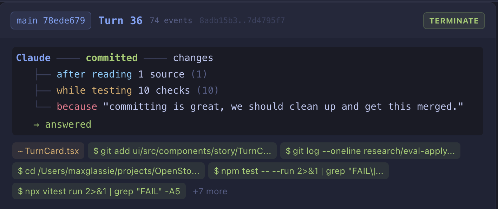
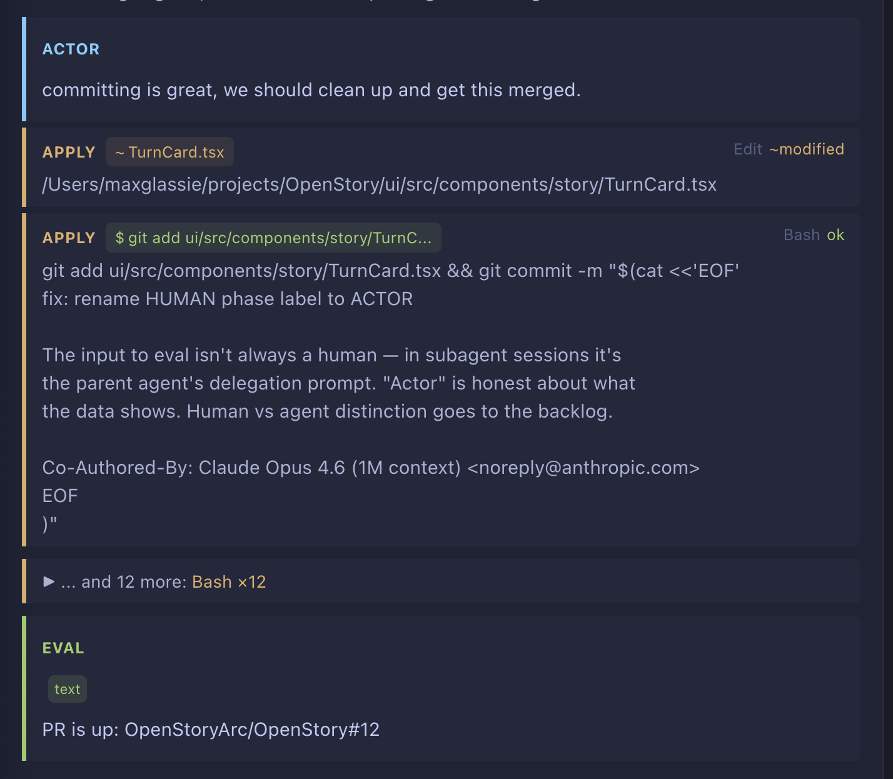
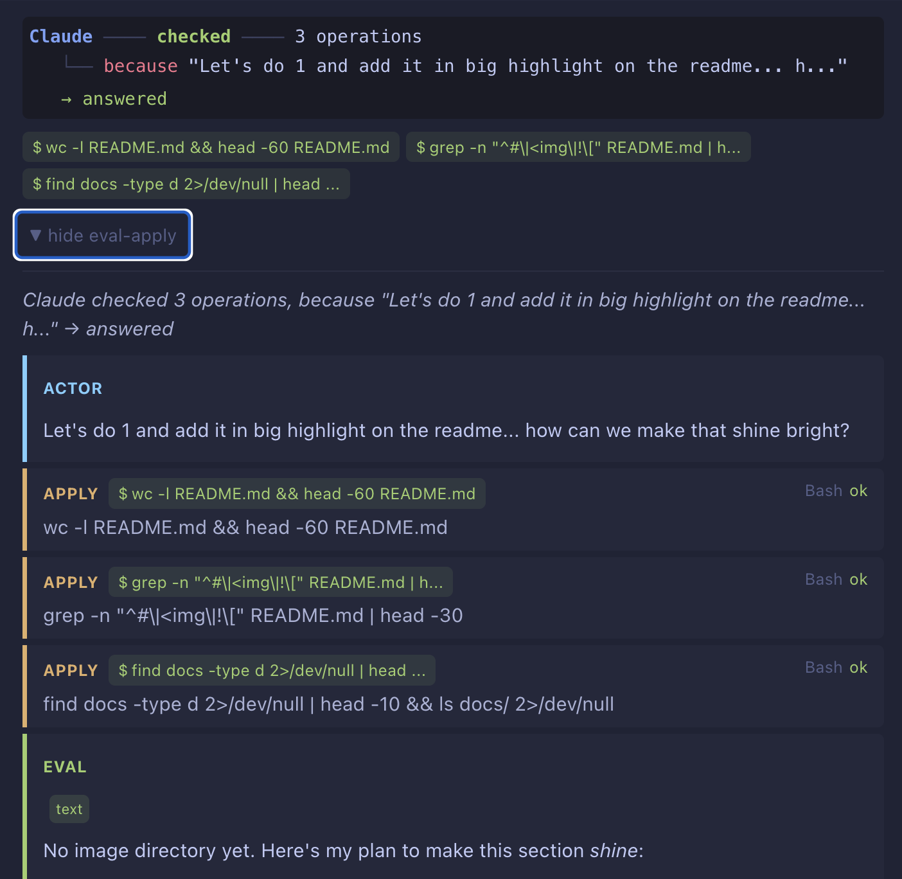

# Open Story

[](https://github.com/OpenStoryArc/OpenStory/actions/workflows/test.yml)
[](LICENSE)

**Read your agent history.**

Your coding agents already write everything down — tool calls, edits, commands, decisions. Open Story watches those local transcripts and makes the history legible: **live** as work happens, **mid-session** while a session is still open, and **after** when you need the story, the cost, or the exact command that fixed it. Data stays on your machine, open formats, portable.

A **mirror, not a leash** — never writes back to the agent, never modifies transcripts, never blocks execution.

| I want to… | Go to |
|------------|--------|
| Install and open the dashboard | [Quickstart](#quickstart) |
| See what the UI shows | [What you can read](#what-you-can-read) |
| Read history from inside a session (MCP) | [Using Open Story](#using-open-story) |
| Run from source / Docker / more agents | [Install & run (all options)](#install--run-all-options) |
| Understand design / contribute | [Philosophy](#philosophy) · [docs/](docs/README.md) · [CONTRIBUTING](CONTRIBUTING.md) |
| Look up CLI / API / layout | [Reference](#reference) |

---

## Quickstart

**1. Install & open the dashboard**

```sh
brew install openstoryarc/openstory/openstory
brew services run openstory          # → http://localhost:3002
```

Run a Claude Code session as usual (default watch dir: `~/.claude/projects/`). History appears as the agent works.

Guided setup (watch dir, port, history window): `open-story init`.

**Empty dashboard?** Expected until a coding agent writes a transcript. Not a bug.

**2. Optional — read history from inside a session**

```sh
brew install openstoryarc/openstory/openstory-mcp
# in Claude Code:
/plugin marketplace add openstoryarc/openstory-skills
/plugin install openstory@openstory-skills
/openstory:cost      # also: recap, recall, time, coach, team…
```

That wires MCP so the current session can stream live events and query past ones — same history as the dashboard. Details under [Using Open Story](#using-open-story).

---

## What you can read

Same history, different lenses.

<p align="center">
  
</p>

**Live** — as it happens. Tool calls, file reads, commands, model responses stream in. Sessions group by who produced them (laptop, teammate, agent on a VPS).

**Story** — narrative. Each turn becomes a sentence (“edited X, after reading N files, because … → answered”), with domain facts and expandable eval-apply detail. Subagent work nests inline.

**Explore** — after the fact, across sessions. Search, filters, comparison when you need the source, not the summary.

**Admin** — read-only federation and identity (topology, fleet, sources). Beta.

Click a Story card and the structure under the sentence unfolds:

<p align="center">
  
</p>

<p align="center">
  
</p>

Keyboard shortcuts: [Keyboard navigation](#keyboard-navigation).

---

## Philosophy

**Mission:** read your agent history.  
**Constraint:** observe, never interfere.

Open Story sits beside your agents and makes transcripts legible — live, mid-session, and after. Looking at history does not rewrite the actor. Not a runtime, memory injector, or control plane for the agent.

**Sovereignty:** whichever backend you use (SQLite default, Mongo optional), events are also appended as per-session JSONL under `data/` — always `grep`-able outside the database.

Deeper (mission tenses, attention layer vs reading history, principles in code): **[docs/soul/](docs/soul/)**.

---

## Using Open Story

### Dashboard

After install, open **http://localhost:3002**. Use Live while work is running, Story for narrative, Explore for search.

### From inside a session (MCP + skills)

The optional **`open-story-mcp`** binary is how a session reads the **same** history without grepping transcripts:

| Need | How |
|------|-----|
| Watch this session as it runs | MCP streaming: `subscribe_session`, `subscribe_tokens` |
| What happened so far / in the past | MCP query tools + REST (story, transcript, search, cost, …) |
| Slash commands | [`openstory-skills`](https://github.com/OpenStoryArc/openstory-skills) plugin (`/openstory:cost`, `recap`, `recall`, …) |

Wire MCP into Claude Code:

```bash
claude mcp add --transport stdio openstory -- open-story-mcp
# or: claude mcp add ... -- /opt/homebrew/opt/openstory-mcp/bin/open-story-mcp
```

Defaults to `http://localhost:3002`. Remote/token: set `OPENSTORY_API_URL` / `OPENSTORY_API_TOKEN`. Streaming tools also need `OPENSTORY_NATS_URL` (default `nats://localhost:4222`).

**Attention layer (optional):** `ui_control` / `where_is_user` / `subscribe_ui_state` steer the dashboard to *show or navigate* history — not a second mission. May steer the mirror; may not rewrite history. Full map: [`docs/agent-in-ui.md`](docs/agent-in-ui.md). Trust/architecture: [`docs/mcp-architecture.md`](docs/mcp-architecture.md). Tool catalog: that doc + the skills plugin.

### REST API (essentials)

Prefer the API over raw JSONL or ad-hoc SQLite JSON paths:

```
GET /api/sessions
GET /api/sessions/{id}/records
GET /api/sessions/{id}/patterns?type=turn.sentence
GET /api/search?q=...
```

Full table: [API Endpoints](#api-endpoints). Scripts that wrap the API: [Scripts](#scripts) (`sessionstory.py` first).

### More agents & machines

| Goal | How |
|------|-----|
| pi-mono | `OPEN_STORY_PI_WATCH_DIR=~/.pi/agent/sessions` or `pi_watch_dir` in config |
| Hermes | `OPEN_STORY_HERMES_WATCH_DIR=...` or `hermes_watch_dir` |
| Multi-machine fleet | `OPEN_STORY_NATS_LEAF_URL=...` — see [`docs/deploy/distributed.md`](docs/deploy/distributed.md) |
| Deployed container agents | `docker compose -f docker-compose.openclaw.yml` |

---

## How it works

```
┌─────────────────┐     ┌──────────────┐     ┌──────────────┐     ┌──────────────┐
│  Coding Agent    │────▶│  Transcript  │────▶│  Translate   │────▶│    NATS      │
│  (JSONL files)   │     │  Watcher     │     │  (CloudEvent)│     │  JetStream   │
└─────────────────┘     └──────────────┘     └──────────────┘     └──────┬───────┘
                                                                         │
                                                          ┌──────────────┼──────────────┐
                                                          ▼              ▼              ▼
                                                   persist       patterns      broadcast
                                                   → store       → turns       → UI (WS)
```

Watch local JSONL → translate to [CloudEvents](https://cloudevents.io/) → NATS JetStream → independent consumers (persist, patterns, projections, broadcast). Supported agents include Claude Code, pi-mono, and Hermes (auto-detected per file).

Narrative structure: **turns** (one prompt → response) containing **eval-apply** cycles; Story renders that hierarchy. Architecture narrative: [`docs/soul/architecture.md`](docs/soul/architecture.md). Code walk: [`docs/architecture-tour.md`](docs/architecture-tour.md).

Schemas live under `schemas/` (generated from Rust types). Principle tests guard observe-only and purity — see `CLAUDE.md` and `cargo test --test test_principle_*`.

---

## Install & run (all options)

Requires for source builds: [Rust](https://rustup.rs/), [Node.js](https://nodejs.org/) 20+, [NATS](https://nats.io/) (`brew install nats-server`), [just](https://github.com/casey/just) recommended. Docker/Podman for E2E only.

> **NATS** is strongly preferred: four actor-consumers (persist, patterns, projections, broadcast) subscribe to the same stream so the UI stays live and failure domains stay separate. Without NATS, a single inline pipeline works for demos but drops durable replay and clean boundaries.

### Homebrew (recommended)

```sh
brew tap OpenStoryArc/openstory
brew install openstory
open-story init --data-dir "$(brew --prefix)/var/openstory"
brew services run openstory      # background for this login; not at-login
# at login: brew services start openstory
```

Dashboard: <http://localhost:3002>. Data: `$(brew --prefix)/var/openstory` (survives uninstall). First install may build from source (~1–3 min).

| Formula | Provides |
|---|---|
| `openstory` | Server + CLI + managed NATS + dashboard |
| `openstory-mcp` | Optional MCP companion (`depends_on openstory`) |

```sh
brew install openstoryarc/openstory/openstory-mcp
```

### From a git checkout

```bash
just up          # NATS + server + UI (Ctrl+C to stop)
just test        # Rust + UI tests
```

Launcher script (optional):

```bash
cp scripts/openstory ~/.local/bin/openstory
# edit OPEN_STORY_ROOT in the script
openstory .      # server + UI, watch current dir
openstory stop
```

### Manual (three terminals)

```bash
nats-server -c nats.conf &
cd rs && cargo run -p open-story-cli -- serve
cd ui && npm install && npm run dev    # :5173 proxies to :3002
```

### Docker / Podman

```bash
docker compose up        # NATS :4222, API :3002, UI :5173
```

Mounts `~/.claude/projects/` read-only. Podman works as a Docker-compatible runtime on Windows/WSL2.

### Optional: MongoDB backend

SQLite is default. Mongo: build with `--features mongo`, set `OPEN_STORY_DATA_BACKEND=mongo` (and URI/DB). Same `EventStore` contract; JSONL backup still written.

### Verify

```bash
curl -s -o /dev/null -w "%{http_code}\n" http://localhost:3002/api/sessions   # expect 200
# then run a coding-agent session — events should appear in the dashboard
```

Federation, leaf NATS, and identity (`person_id` / principals): [`docs/deploy/distributed.md`](docs/deploy/distributed.md). OpenClaw split deploy: `docker-compose.openclaw.yml`.

---

## Reference

### Keyboard navigation

#### Live tab

| Key | Sidebar (sessions) | Timeline (events) |
|-----|--------------------|--------------------|
| `↑` / `↓` | Move between sessions | Move between event cards (skips turn dividers) |
| `→` | Jump focus to timeline | — |
| `←` | — | Jump focus to sidebar |
| `Enter` | Select highlighted session | Open selected card in Explore |
| Click | Select session + start keyboard nav | Select card + start keyboard nav |

Only the focused panel shows the selection ring. Position is remembered when switching panels.

#### Explore tab

| Key | Sidebar (turns/facets) | Event list |
|-----|------------------------|------------|
| `↑` / `↓` | — | Move between event cards |
| `→` | Jump focus to event list | — |
| `←` | — | Jump focus to sidebar |
| Click | — | Select card + expand/collapse |

**Cross-linking:** Explore ↗ on a Live card (or Enter on a selected Live card) deep-links that event in Explore.

### CLI Reference

```
open-story init [OPTIONS]      Interactive first-run setup wizard
  --data-dir <DIR>               Where config + data live [default: ./data]

open-story serve [OPTIONS]     Start the dashboard server (default)
  --host <HOST>                  Bind address [default: 127.0.0.1; auto-detects 0.0.0.0 in containers/WSL]
  --port <PORT>                  Listen port [default: 3002]
  --data-dir <DIR>               Session persistence directory [default: ./data]
  --static-dir <DIR>             Built UI static files directory
  --watch-dir <DIR>              Transcript watch directory [default: ~/.claude/projects/]

open-story watch [OPTIONS]     Watch transcripts, emit CloudEvents to stdout
  --watch-dir <DIR>              Directory to watch [default: ~/.claude/projects/]
  --output <FILE>                Output file (JSONL append)
  --backfill                     Process existing files before watching
  --quiet                        Suppress stdout output

open-story synopsis <SESSION_ID> Show session synopsis (goal, journey, outcome)
  --data-dir <DIR>               Session data directory [default: ./data]
  --format <FMT>                 Output format: text or json [default: text]

open-story pulse [OPTIONS]     Project activity over N days
  --days <N>                     Number of days to look back [default: 7]
  --data-dir <DIR>               Session data directory [default: ./data]
  --format <FMT>                 Output format: text or json [default: text]

open-story context <PROJECT>   Recent sessions for a project
  --data-dir <DIR>               Session data directory [default: ./data]
  --format <FMT>                 Output format: text or json [default: text]
```

### API Endpoints

| Method | Path | Description |
|--------|------|-------------|
| GET | `/api/sessions` | List all sessions |
| GET | `/api/sessions/{id}/events` | Raw CloudEvents for a session |
| GET | `/api/sessions/{id}/events/{event_id}/content` | Full content for a truncated event |
| GET | `/api/sessions/{id}/view-records` | Typed ViewRecords for a session |
| GET | `/api/sessions/{id}/records` | WireRecords from projections |
| GET | `/api/sessions/{id}/summary` | Session summary analytics |
| GET | `/api/sessions/{id}/activity` | Activity timeline |
| GET | `/api/sessions/{id}/tools` | Tool usage distribution |
| GET | `/api/sessions/{id}/transcript` | Reconstructed conversation |
| GET | `/api/sessions/{id}/conversation` | Structured conversation view |
| GET | `/api/sessions/{id}/file-changes` | File change history |
| GET | `/api/sessions/{id}/patterns` | Detected behavioral patterns |
| GET | `/api/sessions/{id}/plans` | Plans for a session |
| GET | `/api/sessions/{id}/meta` | Session metadata |
| GET | `/api/plans` | List all plans |
| GET | `/api/plans/{id}` | Get a specific plan |
| GET | `/api/tool-schemas` | Tool schema definitions |
| GET | `/api/sessions/{id}/turns` | Eval-apply structural turns |
| GET | `/api/insights/token-usage` | Token usage summary across sessions |
| GET | `/api/insights/token-usage/daily` | Daily token usage trends |
| GET | `/api/search?q=` | Full-text search (FTS5) over events |
| GET | `/api/agent/search?q=` | Session-grouped full-text search (agentic) |
| GET | `/api/agent/tools` | Agent tool definitions (MCP-style) |
| GET | `/api/agent/project-context?project=` | Recent sessions for a project |
| GET | `/api/agent/recent-files?project=` | Files modified in recent sessions |
| GET | `/api/sessions/{id}/synopsis` | Session synopsis (goal, journey, outcome) |
| GET | `/api/sessions/{id}/tool-journey` | Sequence of tools used |
| GET | `/api/sessions/{id}/file-impact` | Files read vs written |
| GET | `/api/sessions/{id}/errors` | Session errors with timestamps |
| GET | `/api/insights/pulse?days=` | Project activity over N days |
| GET | `/api/insights/tool-evolution` | Tool usage evolution across sessions |
| GET | `/api/insights/efficiency` | Session efficiency insights |
| GET | `/api/insights/productivity?days=` | Event density by hour of day |
| DELETE | `/api/sessions/{id}` | Delete a session |
| GET | `/api/sessions/{id}/export` | Export session as JSONL |
| GET | `/api/users` | List known users |
| GET | `/api/local-info` | Local environment info |
| GET | `/health` | Health check (no auth) |
| GET | `/ws` | WebSocket for live event streaming |

### Project Layout

```
open-story/
├── rs/                          Rust workspace (10 crates)
│   ├── core/                    open-story-core (CloudEvent types, translators)
│   ├── bus/                     open-story-bus (NATS JetStream)
│   ├── store/                   open-story-store (persistence, projection, FTS5)
│   ├── views/                   open-story-views (CloudEvent → ViewRecord)
│   ├── patterns/                open-story-patterns (eval-apply + sentence)
│   ├── schemas/                 open-story-schemas (JSON Schema generation)
│   ├── server/                  open-story-server (HTTP/WS, API, consumers)
│   ├── src/                     open-story lib (orchestration)
│   ├── cli/                     open-story-cli
│   ├── mcp/                     open-story-mcp
│   └── tests/                   Integration + principle tests
├── schemas/                     Committed JSON Schema files
├── ui/                          React dashboard
├── scripts/                     Analysis tools
├── docs/                        Philosophy, deploy, research
└── e2e/                         Playwright E2E tests
```

### Scripts

`scripts/` answers questions with reproducible queries (REST or SQLite). Most support `--test`.

**Start here:**

```bash
python3 scripts/sessionstory.py SESSION_ID            # markdown fact sheet
python3 scripts/sessionstory.py latest
python3 scripts/sessionstory.py SESSION_ID --unfinished
python3 scripts/sessionstory.py --list
```

| Area | Scripts |
|------|---------|
| Structure | `analyze_eval_apply_shape.py`, `analyze_turn_shapes.py`, `analyze_event_groups.py`, `analyze_session_hierarchy.py` |
| Cost | `token_usage.py` (`--session-id`, `--by-session`, `--by-day`) |
| Direct query | `query_store.py`, `query_session.py`, `session_conversation.py`, `event_viewer.py` |

Prefer the REST API over grepping raw agent JSONL. See `docs/research/sessions/` for example reports.

### Development commands

Run `just` for the full list.

| Command | Description |
|---------|-------------|
| `just up` | NATS + server + UI |
| `just test` | Rust + UI tests |
| `just test-rs` / `just test-ui` | Split |
| `just e2e` | Playwright |
| `just docker-build` / `just test-container` / `just test-compose` | Container path |
| `just observe` | Stack + Prometheus + Grafana |
| `just mongo` | MongoDB container |
| `just explore` | Jupyter |
| `just events` | Live event viewer |

### Security notes

- **Auth** is off by default (localhost). Set `api_token` in `data/config.toml` for non-local deployments (bearer on API/WS).
- **`/metrics`** bypasses auth for Prometheus scrapes.
- **`docker-compose.observe.yml`** Grafana password `openstory` is local-dev only.

### Contributing

Read [docs/soul/philosophy.md](docs/soul/philosophy.md) and [CONTRIBUTING.md](CONTRIBUTING.md). Doc map: [docs/README.md](docs/README.md).

### License

Apache License 2.0 — see [LICENSE](LICENSE).
