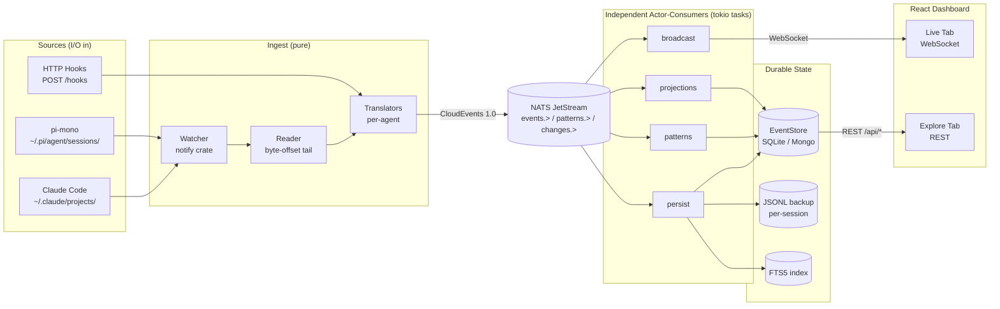
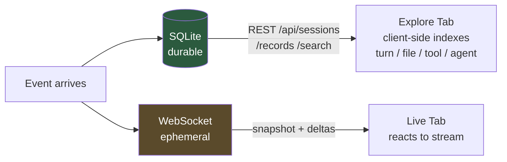
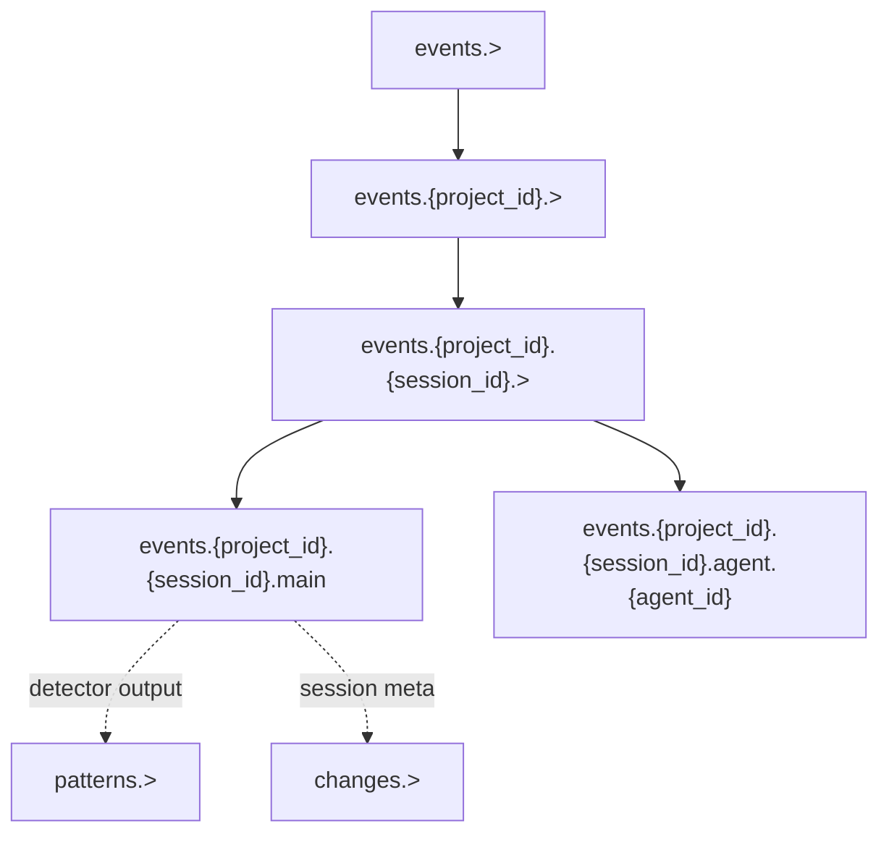
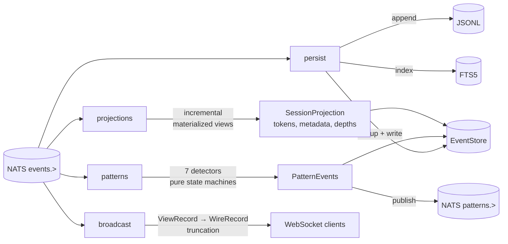
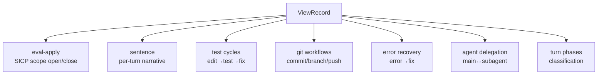
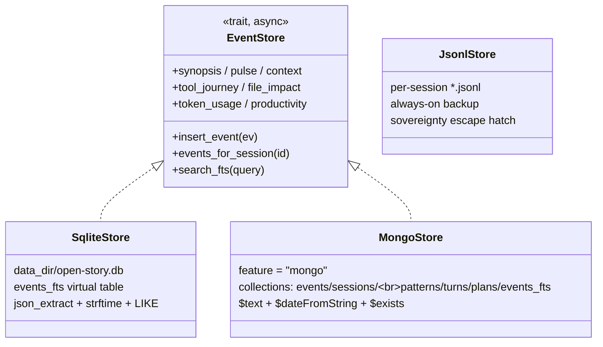
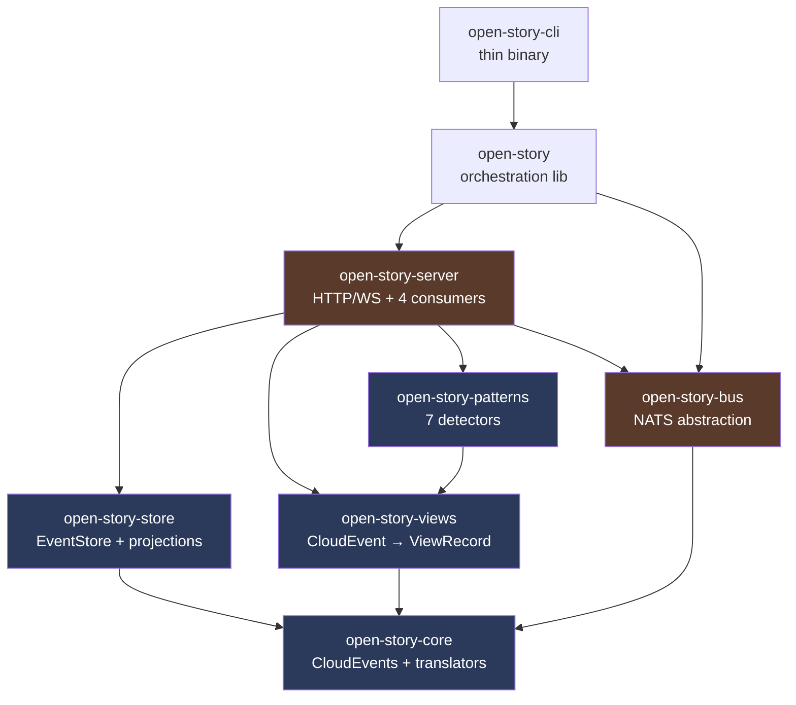
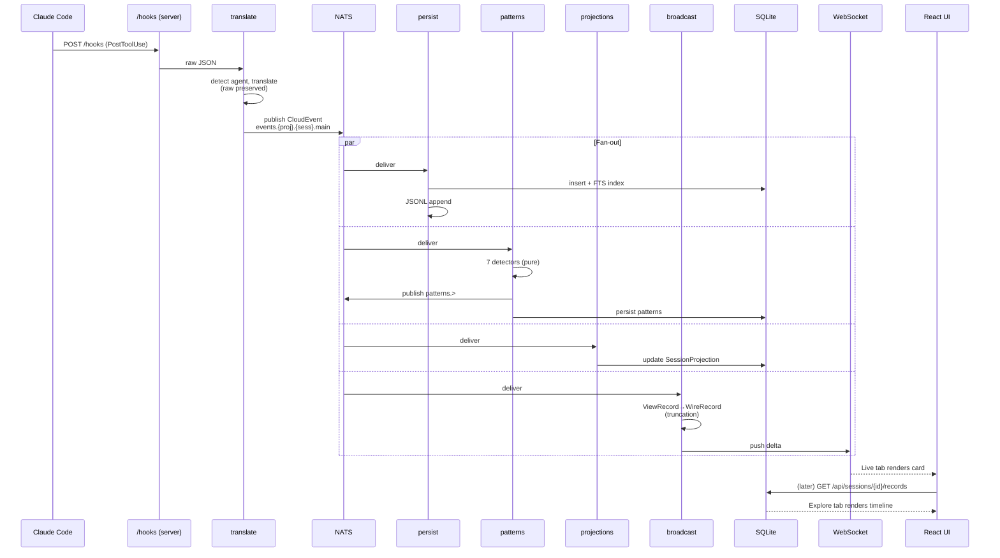
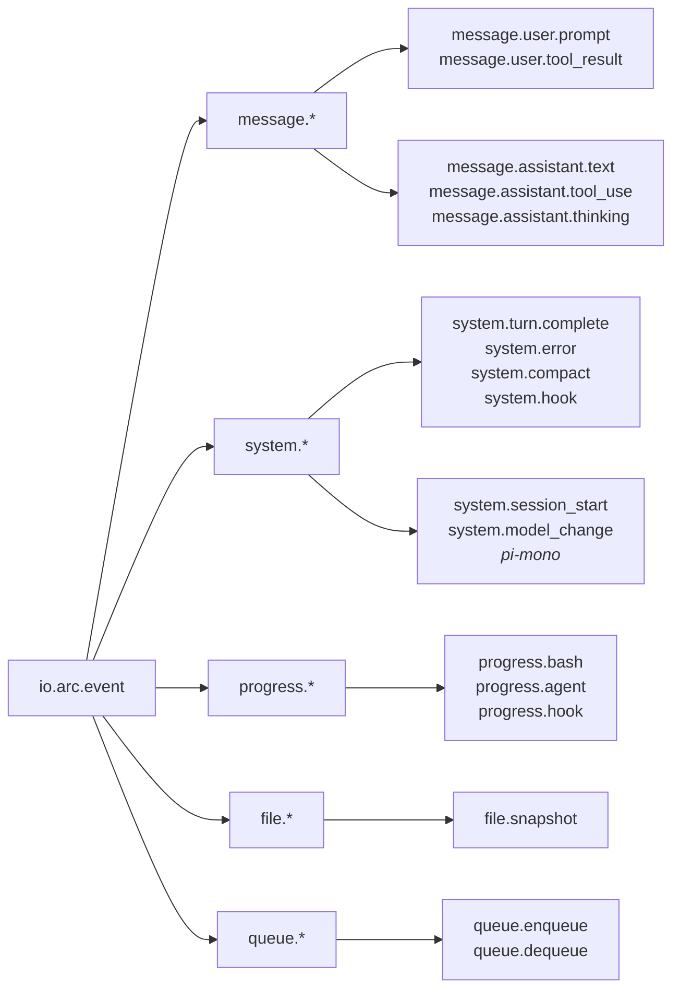
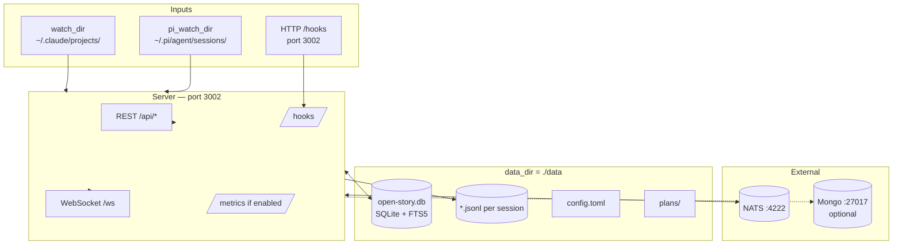

# Open Story — Architecture Overview

A visual companion to [`docs/soul/architecture.md`](./soul/architecture.md). This file is all diagrams: what flows where, who owns what state, and how the pieces fit together.

---

## 1. The whole pipeline at a glance

Events flow one direction from coding agents to the dashboard. No component writes back upstream.



**Key properties**
- Read-only observation: no component ever writes back to the coding agent.
- Functional core: translate/views/patterns are pure; side effects live at watcher/server/consumer boundaries.
- Each consumer is an independent failure domain — no shared `RwLock`, only `Arc<dyn EventStore>`.

---

## 2. Two data paths to the UI

The Live and Explore tabs are deliberately **never merged**. Each is honest about its data source.



| Path | Durability | Consumer | UI tab |
|---|---|---|---|
| SQLite → REST | durable, authoritative | `persist` + `projections` | Explore |
| Broadcast → WebSocket | ephemeral, live | `broadcast` | Live |

---

## 3. NATS subject hierarchy

Subjects encode the parent/child relationship between a main session and its subagents. A single wildcard subscription captures both.



Streams:

| Stream | Retention | Purpose |
|---|---|---|
| `events` | limits-based, 1 GB | all CloudEvents from sources |
| `patterns` | durable | detector outputs (eval-apply, sentence, phases…) |
| `changes` | interest-based | session metadata deltas |

---

## 4. The four consumer actors

Each is a `tokio::spawn`ed task subscribing to the same NATS stream. They share **no mutable state** — the contract between them is the NATS subject, nothing else.



**The 7 pattern detectors** (`rs/patterns/src/`, one file each):



Each detector implements `(state, event) → (new_state, patterns)` — a pure state machine, no I/O.

---

## 5. Persistence layer — the EventStore seam

`EventStore` is an async trait; two backends implement it and a 47-helper conformance suite enforces semantic parity.



**Backend selection** (`data/config.toml`):

```toml
data_backend = "sqlite"   # default
# data_backend = "mongo"  # requires --features mongo
```

Boot fails loudly if `mongo` is configured without the feature compiled in — **never silently falls back**.

JSONL is always on, regardless of backend. Your data is always grep-able from outside the database.

---

## 6. Crate dependency graph

The Rust workspace has 8 members. The CLI is a thin wrapper so `cargo test` never touches the binary (avoids Windows file-lock conflicts).



Blue = pure domain logic. Orange = infrastructure with side effects.

> `rs/semantic/` exists on disk but is **not** a workspace member — vestigial Qdrant code scheduled for removal.

---

## 7. End-to-end trace: one tool call

Follow a single `PostToolUse` hook from Claude Code to the Explore tab.



---

## 8. Event type taxonomy

All events share `type: "io.arc.event"` and carry an `agent` discriminator. The `subtype` is hierarchical.



The `agent` field (`"claude-code"`, `"pi-mono"`) lets the views layer branch on format-specific fields without mutating `data.raw`.

---

## 9. Config & I/O surface summary



**Default ports:** server `3002`, UI dev `5173`, NATS `4222`, Mongo `27017`, Qdrant `6334`.

---

## See also

- [`docs/soul/architecture.md`](./soul/architecture.md) — prose version with more "why"
- [`docs/soul/philosophy.md`](./soul/philosophy.md) — principles that shaped these choices
- [`docs/architecture-tour.md`](./architecture-tour.md) — 14-stop guided code walkthrough
- [`docs/soul/patterns.md`](./soul/patterns.md) — learned anti-patterns (what *not* to do)
