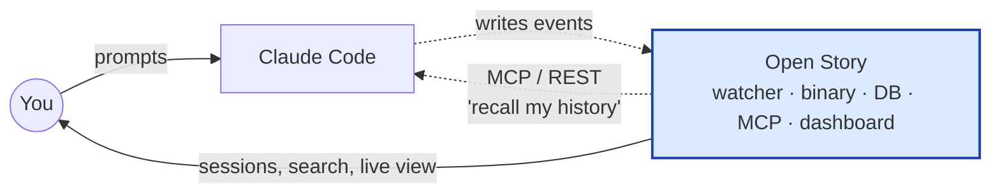
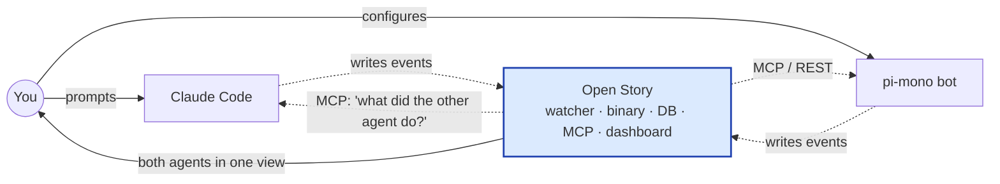
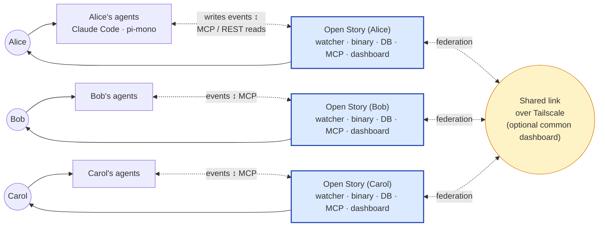
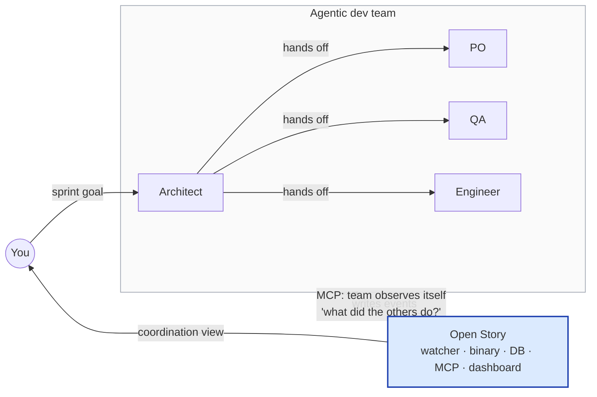
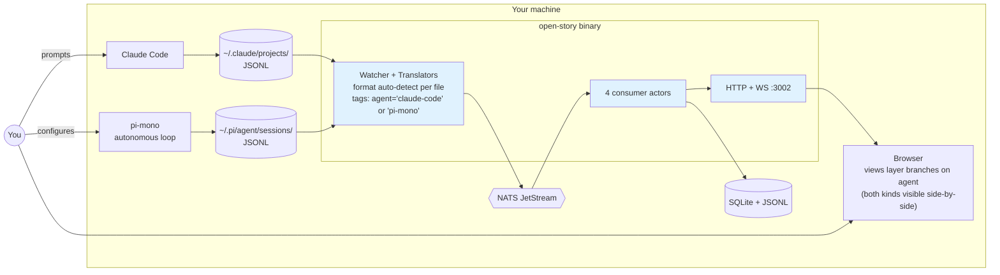
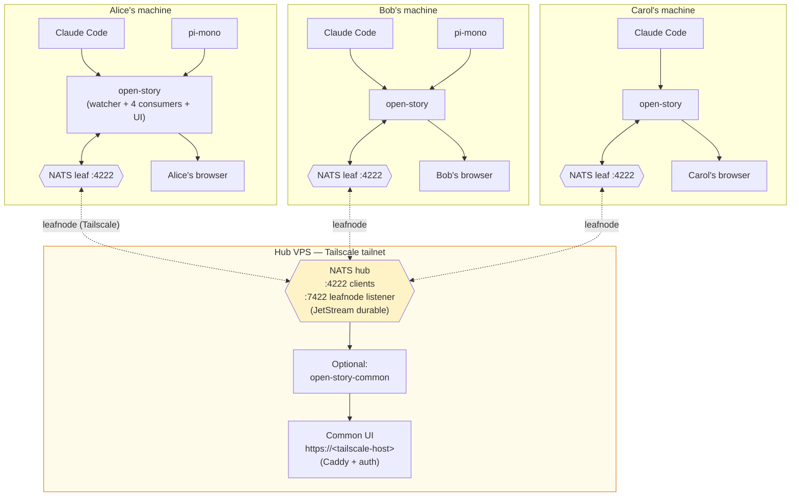

# Open Story — Logical Topologies by Use Case

Companion to [`architecture-overview.md`](./architecture-overview.md). That doc
shows the *internal* pipeline (watcher → translate → NATS → 4 consumers →
EventStore → UI). This doc shows the *deployment* shapes — how many machines,
how many people, how many agents — and what stays constant across all of them.

The headline: **the same pipeline serves every shape**. Adding agents adds
sources. Adding people adds federated NATS. Nothing about the consumers, the
EventStore, or the UI changes. That's not a coincidence — it's a direct
consequence of three architectural commitments:

1. **One-way data flow.** Sources publish, consumers subscribe; nothing writes
   back upstream. Adding a new source can't break an existing one.
2. **Agent-discriminated CloudEvents.** The `agent` field on every event lets
   the views layer branch on type at the rendering boundary. Translators stay
   pure and per-agent.
3. **Hierarchical NATS subjects + leafnode federation.** `events.{project}.{session}.main`
   and `events.{project}.{session}.agent.{id}` encode parent-child relationships
   in the routing key, and JetStream leafnodes let any local NATS replicate to
   any other one without code changes.

The four use cases below are progressive — each adds one capability while
re-using everything from the prior case.

---

## At a glance — the four shapes (no internals)

If you're new to Open Story, start here. **The blue box is the same in every
diagram**: one Open Story instance — watcher, binary, database, MCP server,
and dashboard, all together. What changes between the four shapes is the
*world around it* — how many humans, how many agents, whether multiple
machines are stitched together. Look at the blue box first to see what stays
put; everything else is variation.

> **Open Story is a two-way mirror, not a one-way recorder.** Every diagram
> below shows arrows in *both* directions between the agents and the blue
> box. Agents *write* events to Open Story (their transcripts, observed by
> the watcher). Agents also *read* from Open Story — via MCP tools, the REST
> API, or the WebSocket — to recall their own history *and observe what
> other agents did*. That second arrow is the one that makes Shape 4
> tractable: the Engineer doesn't read the QA's transcript files; they ask
> Open Story. Humans get the same back-channel through the dashboard and the
> same APIs. **Open Story is the team's shared memory.**

### Shape 1 — Solo local

One person, their coding agent, one Open Story watching it. Even alone, the
back-channel matters: the agent can MCP into Open Story to recall what it
did in earlier sessions.



### Shape 2 — Person + autonomous bot

You + an interactive Claude Code session + a long-running pi-mono bot. Open
Story watches both transcripts and shows them in the same dashboard. Either
agent can MCP into Open Story to read what *the other one* did — that's how
your morning Claude Code session catches up on what pi-mono did overnight.



### Shape 3 — Several people + bots, federated

Each person runs their own Open Story instance. The instances are stitched
together over Tailscale so events flow between them. Each person's *agents*
can MCP into their *local* Open Story and — because the federation
replicates everyone's events into every node — see what other people's
agents are doing. Bob's Claude Code can ask Bob's Open Story "what did
Alice's pi-mono try yesterday?" and get an answer locally.



### Shape 4 — Person + agentic dev team

One human directs a team of agents (Architect, PO, QA, Engineer). Each agent
runs as its own coding session. **The back-channel from Open Story to the
team is what makes this shape work**: the Engineer doesn't read the QA's
transcript files; they MCP into Open Story and ask "what test cases did QA
write for this spec?" The Architect can ask "did anyone try this approach
already?" Open Story is the team's shared episodic memory, queryable by
every member.



> **The blue box is the message.** Same Open Story in every shape — the only
> things that change between scenarios are the agents around it and (in
> Shape 3) whether multiple instances are linked. Notice the **two arrows**
> between every agent and the blue box: write-in (events) and read-back
> (MCP / API / WS). The read-back is what makes Open Story a coordination
> tool, not just a recorder.
>
> Below, each shape is redrawn with the blue box exploded so you can see the
> watcher, the bus, the consumers, the database, and the API surface inside.
> **New users can stop here**; jump to "Choosing your shape" near the bottom
> for which one fits you.

---

## 1. Solo local — one human, one agent, one machine

The minimum useful Open Story. You run Claude Code on your laptop. Open Story
watches the transcripts directory, translates events, ships them through a
local NATS bus to four consumer actors, persists to SQLite, and serves a
dashboard at `localhost:3002`.

```mermaid
flowchart LR
    H((You))

    subgraph Machine["Your machine"]
        CC[Claude Code agent]
        FS[("~/.claude/projects/<br/>JSONL transcripts")]

        subgraph OS["open-story binary"]
            WTR[Watcher + Translator<br/>agent: 'claude-code']
            ACT[4 consumer actors<br/>persist · patterns · projections · broadcast]
            SRV["HTTP + WS + MCP :3002<br/>(consumed by humans AND agents)"]
        end

        NATS{{"NATS JetStream :4222<br/>events.&#123;project&#125;.&#123;session&#125;.main"}}
        DB[("SQLite + JSONL backup<br/>./data")]
        UI[Browser]
    end

    H -->|prompts| CC
    CC -->|writes| FS
    FS -->|file events| WTR
    WTR -->|publish CloudEvents| NATS
    NATS -->|subscribe| ACT
    ACT --> DB
    ACT --> SRV
    SRV -->|REST + WebSocket| UI
    SRV -.->|MCP: 'recall my history'| CC
    H -->|reads| UI

    style WTR fill:#e0f2fe
    style ACT fill:#e0f2fe
    style SRV fill:#e0f2fe
```



**Why this shape:** Open Story's principle is *observe, never interfere* — the
watcher is the only contact with the agent, and it's read-only. NATS feels
heavy for a single-machine setup but it's load-bearing: the four consumers
become independent failure domains (a pattern bug can't crash the persistence
path, a slow disk can't block the broadcast). It also means scaling up is just
adding subscribers, not redesigning the topology.

**Recreating:** `just up-no-mongo` (NATS native + open-story native + Vite).
The watcher uses inotify/FSEvents at native speed. See
[`docs/deploy/dev-on-leaf.md`](./deploy/dev-on-leaf.md) for the Docker variant
which uses `OPEN_STORY_WATCHER=poll`.

---

## 2. Person + pi-mono bot — multi-agent observability

You're now running Claude Code interactively *and* a long-running pi-mono
autonomous agent on the same machine. Two transcript directories, two file
formats, two `agent` discriminators — but only one Open Story instance and one
UI. The translators are per-agent (each preserves its agent's native field
names in `data.raw`); the views layer branches on the `agent` field at render
time.



**Why this shape:** This is the test case that justifies *not* normalizing
agent-specific fields in the translator. We tried that once (mapping pi-mono's
`toolCall` → `tool_use` so the views layer wouldn't need changes) and it
broke functional purity (the translator's output no longer contained its
input). The fix: each translator preserves its native shape, sets the `agent`
discriminator, and the views layer renders accordingly. See
`docs/soul/patterns.md` ("Don't mutate `raw` or normalize agent-specific
fields") for the full story.

**What you gain:** unified observability. Bash commands the autonomous pi-mono
agent runs while you sleep show up in the same dashboard as your interactive
Claude Code prompts, with the same search, the same patterns analysis, the
same sessions API.

**Recreating:** identical to use case 1, plus `pi_watch_dir` set in
`data/config.toml` (or `OPEN_STORY_PI_WATCH_DIR` env) pointing at
`~/.pi/agent/sessions/`.

---

## 3. Several people + several bots — federated via Tailscale

Each person runs a Use Case 2 stack on their own machine. A central NATS
**hub** runs on a Tailscale-attached VPS. Each local NATS is configured as a
**leafnode** that connects out to the hub on `:7422`. Leafnode replication is
bidirectional: events you publish locally flow to the hub; events others
publish flow down to your local NATS. Your Open Story consumes its local NATS
just like in Use Case 1 — it doesn't know or care that some events originated
on someone else's machine.



**Why this shape:** the leaf-and-hub topology gets you team-wide observability
*without* a single point of dependency. Each person's local Open Story keeps
working if the VPS goes down — they just stop seeing other people's events
until the link recovers, at which point JetStream replays whatever they
missed. Each user's data stays on their machine in JSONL form regardless
(sovereignty principle: the user's data is portable and useful even without
this tool).

**Tradeoffs that fall out of this design:**
- **Authentication is per-link, not per-user.** The hub uses a NATS bearer
  token in the leafnode URL. Anyone with the token can join. ACLs at the
  Tailscale level (who can reach `:7422`) are the real access control.
- **The common UI is optional.** If everyone has their own dashboard, the
  hub doesn't need its own Open Story — it can just be a NATS relay. We
  added one because some setups want a "team dashboard" URL for non-laptop
  contexts (phones, the office TV).
- **JetStream storage on the hub is the durable record of team activity.**
  Local stores are for solo replay; the hub is the cross-machine archive.

**Recreating:** see [`docs/deploy/distributed.md`](./deploy/distributed.md) for
the original design and [`docs/deploy/dev-on-leaf.md`](./deploy/dev-on-leaf.md)
for the developer-machine variant we're using right now.

---

## 4. Person + agentic dev team — subagent orchestration

One human directs a multi-agent team — for example, the Raptor sprint workflow
in this repo's git history: an Architect (Anky), QA (Vex), Product Owner
(Petra), and Engineer (Trix). Each agent runs as its own Claude Code (or
pi-mono) instance with a defined role; they hand work off via specs in
`docs/specs/` and `docs/architecture/`. From Open Story's point of view they
are just *more sources writing transcripts* — but the **hierarchical NATS
subject** captures their parent-child relationships:

```
events.{project}.{session}.main              ← top-level (Architect coordinates)
events.{project}.{session}.agent.{agent_id}  ← spawned subagent (per role)
```

A subscriber to `events.{project}.{session}.>` gets the main agent and every
subagent it spawned, in one stream, in causal order.

```mermaid
flowchart LR
    H((You))

    subgraph Mach["Your machine (or distributed across containers)"]
        subgraph Team["Agentic dev team"]
            ANKY[Anky · Architect<br/>main session]
            PETRA[Petra · PO<br/>subagent]
            VEX[Vex · QA<br/>subagent]
            TRIX[Trix · Engineer<br/>subagent]
        end

        FS[("Per-agent transcripts<br/>~/.claude/projects/<br/>per-session JSONL files")]

        OS[open-story binary]

        NATS{{"NATS JetStream<br/>events.&#123;project&#125;.&#123;session&#125;.main<br/>events.&#123;project&#125;.&#123;session&#125;.agent.petra<br/>events.&#123;project&#125;.&#123;session&#125;.agent.vex<br/>events.&#123;project&#125;.&#123;session&#125;.agent.trix"}}

        UI["Browser<br/>shows team coordination<br/>(handoffs, escalations,<br/>parent → child events)"]
    end

    H -->|sprint spec| ANKY
    ANKY -->|spawns / hands off| PETRA
    ANKY -->|spawns / hands off| VEX
    ANKY -->|spawns / hands off| TRIX
    ANKY --> FS
    PETRA --> FS
    VEX --> FS
    TRIX --> FS
    FS --> OS
    OS --> NATS
    NATS --> OS
    OS --> UI
    H --> UI

    style ANKY fill:#dbeafe
    style PETRA fill:#fce7f3
    style VEX fill:#dcfce7
    style TRIX fill:#fef3c7
    style NATS fill:#fffbeb
```



**Why this shape:** when an Architect hands a task to an Engineer who hands a
defect to QA who escalates to the PO, the conversation crosses four sessions.
The subject hierarchy lets the dashboard reconstruct that trajectory: filter
by `events.openstory.sprint-42.>` and you see every step the team took, in
order, without needing each agent to know about the others. The handoff
discipline lives in commit messages (`[HANDOFF]`, `[ESCALATE]`) and spec
files; the topology just records what each agent did.

**What this composes with:**
- **Use Case 3** — the team can be distributed across machines if each role
  runs on its own host, with the hub stitching their NATS together. The
  subject hierarchy works identically over leafnodes.
- **Use Case 2** — pi-mono can play any role. We've used pi-mono for
  long-running autonomous loops and Claude Code for interactive review;
  Open Story doesn't care which is which.

**Recreating:** at the time of writing, the Raptor team workflow lives in
`TEAM.md` and the sprint artifacts under `docs/specs/`, `docs/architecture/`,
and `tests/bdd/`. Each role is a Claude Code instance booted with a
role-specific system prompt. The handoff convention is enforced by commit
message tags and the agents reading `git log`.

---

## What stays constant across all four

| Layer | Solo | + pi-mono | Federated | + Team |
|---|---|---|---|---|
| **CloudEvent schema** | unchanged | unchanged | unchanged | unchanged |
| **Translator (per-agent)** | claude-code | + pi-mono | same | same |
| **NATS subject hierarchy** | `events.{p}.{s}.main` | same | replicated via leafnode | adds `events.{p}.{s}.agent.{id}` |
| **4 consumer actors** | unchanged | unchanged | unchanged | unchanged |
| **EventStore (SQLite/Mongo)** | unchanged | unchanged | unchanged | unchanged |
| **REST + WS API** | unchanged | unchanged | unchanged | unchanged |
| **UI rendering** | claude-code only | branches on `agent` | branches on `agent` | branches on `agent`, groups by hierarchy |

The progression validates the architecture: when adding a new capability
requires only adding *more of the same kind of source* (more agents, more
people, more roles) and not redesigning the pipeline, the seams are in the
right places.

## What changes

| Layer | Solo | + pi-mono | Federated | + Team |
|---|---|---|---|---|
| **Watch dirs** | 1 | 2 | 1–2 per machine | 1–2 per machine |
| **NATS instances** | 1 local | 1 local | 1 leaf per machine + 1 hub | same as federated |
| **Tailscale required** | no | no | **yes** | yes if distributed |
| **Auth/ACL surface** | none | none | NATS bearer token + Tailscale ACLs | same as federated |
| **Cross-machine durability** | n/a | n/a | hub JetStream | same as federated |

## Choosing your shape

- **Are you the only one looking at this?** → Use Case 1 or 2 — keep it
  local. No Tailscale, no hub, no auth surface.
- **Do you and a collaborator want to see each other's work?** → Use
  Case 3 — leaf nodes + a small VPS hub. The setup is one weekend; the
  payoff is durable.
- **Are you orchestrating multiple agents on one task?** → Use Case 4. Even
  if all agents run on your laptop, the subject hierarchy is what makes the
  dashboard legible — without it, four agents' transcripts merge into a
  blur.
- **Are you running an agentic team distributed across machines?** → Use
  Case 4 *on top of* Use Case 3. The two compose cleanly because the
  decision to put NATS at the boundary and tag every event with `agent` was
  made for exactly this kind of growth.

## Related docs

- [`architecture-overview.md`](./architecture-overview.md) — internal pipeline
  diagrams (the *what flows where* of a single Open Story instance).
- [`architecture-tour.md`](./architecture-tour.md) — 14-stop guided code
  walkthrough.
- [`deploy/distributed.md`](./deploy/distributed.md) — the original NATS leaf
  topology design and setup.
- [`deploy/dev-on-leaf.md`](./deploy/dev-on-leaf.md) — local UI dev against
  federated data.
- [`soul/architecture.md`](./soul/architecture.md) — the system design
  narrative behind these shapes.
