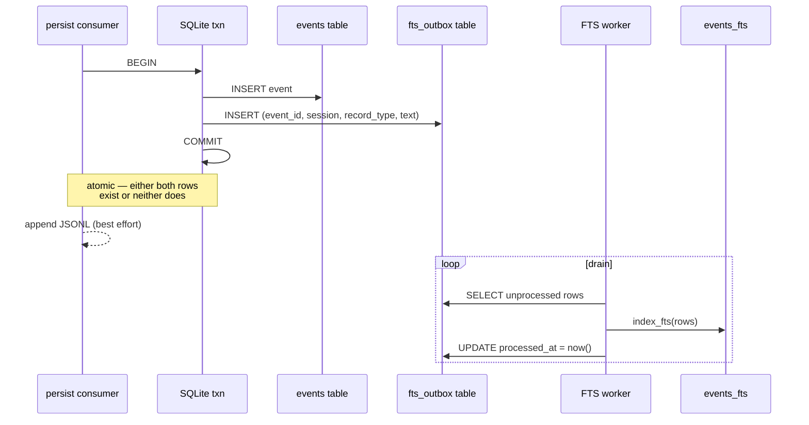

# Consumer idempotency and the FTS-drift outbox

Design notes from a working session investigating dual-write concerns in the four-consumer actor pipeline. This is a discussion document, not a spec — when work begins, the backlog entry is the spec and this file is the research trail.

## Context

The persist consumer does three writes per event (`rs/server/src/consumers/persist.rs:67-98`):

```
insert_event (EventStore PK) → session_store.append (JSONL) → index_fts (FTS5)
```

There is no transaction spanning them, and the last two swallow errors (`let _ = …`). Plus four independent actor-consumers read the same NATS stream, and JetStream is at-least-once — each consumer has to answer "what happens if I see event X twice?" in its own way.

This document audits what's guaranteed today and sketches the smallest change that closes the FTS-drift hole.

## Part 1 — Idempotency audit of the four consumers

### `persist` — idempotent via DB primary key ✅

Source: `rs/server/src/consumers/persist.rs:72-97`.

- `event_store.insert_event()` returns `Ok(false)` on PK collision. The consumer treats that as `skipped` and never reaches the JSONL append or FTS index calls.
- JSONL is gated on `inserted == true` — duplicates don't pollute the backup.
- FTS is gated on `inserted == true` — duplicates don't double-index.
- **Caveat**: idempotency is per-write, not per-batch. If the process crashes *between* `insert_event` succeeding and `index_fts` running, a redelivered batch won't re-index because `insert_event` now returns `false`. **This is the gap the outbox sketch below is designed to close.**

### `patterns` — idempotent, but implicitly ⚠️

Source: `rs/server/src/consumers/patterns.rs:44-93` plus the docstring at `patterns.rs:125-147`.

- State lives in a per-session `PatternPipeline` — a pure fold over events.
- The `is_ephemeral()` filter drops progress / hook / queue / `file.snapshot` events before they touch state.
- The `file.snapshot` filter is load-bearing: earlier versions stamped fresh `start_ts` values on boot replay, emitting "a fresh sentence row for the same logical turn (the H2 case in scripts/inspect_sentence_dedup.py — 1.50× ratio)." So the team has already discovered and fixed a redelivery-duplication bug here.
- The `detected: HashMap<String, Vec<PatternEvent>>` cache (line 27) appends without dedup. Downstream writers (SQLite) need to handle dedup themselves.
- **Risk**: idempotency is a property of the detector implementations (pure + stable ordering + ephemeral filter), not enforced by a primary key. A new detector that uses wall-clock time, or one added without the ephemeral filter, would break it silently. The H2 bug is evidence this regression class exists.

### `projections` — idempotent via `seen_ids: HashSet` ✅

Source: `rs/store/src/projection.rs:141,198,220`.

```rust
seen_ids: HashSet<String>,
// ...
if !event_id.is_empty() && !self.seen_ids.insert(event_id.clone()) {
    return AppendResult::default();
}
```

`SessionProjection::append` short-circuits on duplicate `event_id`. The `ProjectionsConsumer::process_batch` loop is safe to call with the same event any number of times.

- **Caveat**: `seen_ids` is in-memory. On reboot the projection is rebuilt from SQLite via the same `append` calls, and the HashSet repopulates as a side effect — so it self-heals. But the dedup boundary is the *process lifetime*, not the durable store.

### `broadcast` — not idempotent, doesn't need to be ✅ (likely)

- Writes to WebSocket clients, not durable state. Same event pushed twice = client sees it twice.
- Clients in `ui/src/streams/` are expected to dedup by `event_id` on receive. This is inferred from principle, not verified by reading the client code — worth confirming before trusting it.
- The Live tab is explicitly ephemeral, so "a blip of a duplicated card until the next render" is an acceptable failure mode.

### Summary table

| Consumer | Dedup mechanism | Durability of dedup state | Gaps |
|---|---|---|---|
| `persist` | EventStore PK | Durable | Partial-write between insert and FTS index |
| `patterns` | Pure fold + ephemeral filter; downstream writers dedup | In-memory, rebuilt from replay | Implicit — easy to break by adding a non-pure detector |
| `projections` | `seen_ids: HashSet<String>` in `SessionProjection` | In-memory, rebuilt from replay | Process-lifetime only; no cross-check with EventStore |
| `broadcast` | Client-side by event_id | N/A (ephemeral) | Assumes client dedups (verify in `ui/src/streams/`) |

### Observations

1. Only `persist` has durable, authoritative dedup. The other three rely on either in-memory HashSets rebuilt on boot or pure-function determinism. That's consistent with the "actors + pure fold + durable spine" philosophy — the invariant is "replay from NATS or from SQLite produces the same state."
2. `patterns` is the weakest link because its idempotency is a property of detector implementations, not a property enforced by the type system. The H2 `file.snapshot` bug is the canary: these regressions are silent until `scripts/inspect_sentence_dedup.py` is run.
3. Nothing is *wrong* today — this is a codified description of the implicit guarantees.

## Part 2 — Cheap hardening moves (no architecture change)

These should land before any outbox work. Hours of effort, each eliminates a silent-regression class.

1. **Make the patterns dedup explicit.** Add a `seen_ids: HashSet<String>` to `PatternPipeline`, matching what `SessionProjection` already does. Belt-and-suspenders against pure-fold regressions. Pays for itself the first time someone adds a detector that uses wall-clock time.
2. **Assert idempotency in tests.** Each consumer should have a test of the form *"process the same batch twice; assert the second pass is a no-op."* `persist.rs:154-166` already does this. Copy to `patterns.rs` and `projections.rs`.
3. **Confirm client-side dedup** in `ui/src/streams/` so broadcast's reliance on it is documented, not folklore.
4. **Smoke-test `scripts/inspect_sentence_dedup.py` in CI.** It's the canary for the patterns regression class and it's already written.

## Part 3 — Outbox sketch for the FTS-drift gap

The specific gap: `insert_event` succeeds, process crashes or `index_fts` fails, FTS never gets the row, nothing notices until a user's search comes up empty. Classic dual-write problem, classic answer is the **transactional outbox pattern** — write the index intent to the same transaction as the event, then drain the outbox in a separate, restartable worker.

### Minimum-invasive shape

Don't introduce Kafka, Debezium, or a new service. The outbox is a SQLite table in the same database as `events`, so `insert_event` and outbox-insert land in one atomic write. A tiny worker drains it into FTS.



**Why this closes the gap**: the durable event row and the "FTS still needs to happen" marker are written in the same SQLite transaction. It is impossible for the event to exist without the outbox row also existing. A crash after commit leaves the outbox row intact; the worker picks it up on next tick. A crash before commit leaves neither, and NATS redelivery produces the same outcome as a first-time send.

### Minimum schema

```sql
CREATE TABLE fts_outbox (
    event_id     TEXT PRIMARY KEY,
    session_id   TEXT NOT NULL,
    record_type  TEXT NOT NULL,
    text         TEXT NOT NULL,
    created_at   INTEGER NOT NULL,       -- unix ms
    processed_at INTEGER,                 -- NULL until indexed
    attempts     INTEGER NOT NULL DEFAULT 0,
    last_error   TEXT
);
CREATE INDEX fts_outbox_pending ON fts_outbox(created_at)
    WHERE processed_at IS NULL;
```

Partial index on `processed_at IS NULL` keeps the worker's SELECT cheap — the backlog is the only thing ever scanned.

### Persist consumer changes

The three-write sequence becomes a two-write sequence where the second write is a single atomic unit:

```rust
// pseudo-code diff against persist.rs:74-97
let inserted = event_store
    .insert_event_with_fts_outbox(session_id, &val, ce)  // NEW: one atomic call
    .await
    .unwrap_or(false);

if !inserted { skipped += 1; continue; }

// JSONL backup stays best-effort — sovereignty escape hatch, not search index.
let _ = session_store.append(session_id, &val);

persisted += 1;
// No direct index_fts call anymore. The worker handles it.
```

`insert_event_with_fts_outbox` lives on the `EventStore` trait so both backends must implement it. SQLite wraps both inserts in `BEGIN/COMMIT`. Mongo uses either a multi-document transaction against a replica set, or (simpler and good enough for this scale) relies on the outbox row's `event_id` PRIMARY KEY for idempotent retry.

### The FTS worker — a fifth actor

```rust
// rs/server/src/consumers/fts_worker.rs  (new file)
pub struct FtsWorker { event_store: Arc<dyn EventStore> }

impl FtsWorker {
    pub async fn tick(&self, batch_size: usize) -> FtsWorkerResult {
        let pending = self.event_store.outbox_pending(batch_size).await?;
        let mut indexed = 0;
        let mut failed = 0;
        for row in pending {
            match self.event_store
                .index_fts(&row.event_id, &row.session_id, row.record_type, &row.text)
                .await
            {
                Ok(()) => {
                    self.event_store.outbox_mark_processed(&row.event_id).await?;
                    indexed += 1;
                }
                Err(e) => {
                    self.event_store.outbox_record_failure(&row.event_id, &e.to_string()).await?;
                    failed += 1;
                }
            }
        }
        FtsWorkerResult { indexed, failed }
    }
}
```

Wired in `rs/src/server/mod.rs` as a fifth actor alongside persist / patterns / projections / broadcast: own tokio task, own state, own failure domain, reads from the shared `EventStore`. Fits the project's aesthetic — no new dependency, no new deployment.

### Tradeoffs

**Buys**:
- **Atomic persist + search-intent**: a row can never exist without its FTS intent also existing.
- **Restartable**: if the worker crashes, the outbox is a durable queue; next boot drains it.
- **Observable backlog**: `SELECT count(*) FROM fts_outbox WHERE processed_at IS NULL` is a health metric; exposes via `/metrics` for alerting.
- **Retry visibility**: `attempts` and `last_error` columns mean a poison pill shows up in data, not in logs nobody reads.
- **Extensible**: same pattern applies to JSONL, projections, or any other post-insert write that currently "hopes."

**Costs**:
- One extra table and one extra trait method pair. Small.
- One extra tokio task and a tick cadence to tune. Small.
- FTS becomes eventually consistent on the order of the tick interval. Invisible to a human-paced search UI; integration tests that search immediately after insert need a `FtsWorker::tick_until_empty` helper.
- Schema migration (either ship as a migration or `CREATE TABLE IF NOT EXISTS` at boot).
- Conformance parity: the 47-helper suite grows outbox helpers for both backends. Mongo is the harder side — either require a replica set for real transactions, or document that Mongo's outbox is "eventually consistent by redelivery." Fits the existing C1/C2/C3 parity tier model.

### Simpler stepping-stone version

If a full outbox feels heavy for a single dual-write problem, there's an 80/20 version:

1. Add one column to the existing `events` table: `fts_indexed_at INTEGER` (nullable).
2. `insert_event` sets it to `NULL`. `index_fts` updates to `now()` after success.
3. A periodic sweep: `SELECT event_id FROM events WHERE fts_indexed_at IS NULL LIMIT 256` and re-run `index_fts`.

This is the outbox pattern in disguise — the `events` table is the outbox, `fts_indexed_at IS NULL` is the pending predicate. No new table, no new trait method, no new actor if the sweep folds into the existing `persist` consumer's idle cycle. Loses clean separation of concerns and the independent backlog metric, but ships as one PR.

### Reconciliation jobs (the cure side)

The outbox solves *prevention*. A reconciliation job solves *cure* — fixing drift that already exists (including pre-outbox history and the JSONL-vs-EventStore gap the outbox doesn't cover).

Sketch: `scripts/reconcile_fts.py`:

```sql
SELECT event_id FROM events
WHERE event_id NOT IN (SELECT event_id FROM events_fts)
LIMIT 1000
```

For each row, re-run `from_cloud_event → extract_text → index_fts` and report the count. Runs manually or on a `just reconcile` recipe. A JSONL version walks every `*.jsonl` and diffs against `events.event_id`. Neither is hot-path; they're the "did the hot path do its job?" check — fits the BDD ethos of asserting on actual values, not just presence.

## Recommended sequencing

1. **Ship the hardening moves first** (Part 2). Hours of work, eliminates silent-regression class.
2. **Single-column outbox stepping-stone** (`events.fts_indexed_at`). Proves the pattern, exposes a backlog metric, one PR.
3. **Promote to full `fts_outbox` table + `FtsWorker` actor** only if step 2 surfaces real issues or the same machinery is wanted for JSONL / projections.
4. **Write `scripts/reconcile_fts.py`** alongside whichever outbox variant lands — it doubles as the test that proves the outbox is working.

## Open questions

- **Client-side dedup in `ui/src/streams/`** — currently inferred, not verified. Verify before assuming broadcast's idempotency story is complete.
- **Mongo replica-set requirement.** Does the project want to require replica sets for Mongo users (real transactions) or document the "eventually consistent via redelivery" variant as an acceptable tradeoff?
- **Backfill of pre-outbox data.** Every event inserted before the outbox ships has no row in `fts_outbox`. The reconciliation script covers this, but we need to decide whether to run it once at migration time or leave it as a periodic job.
- **FtsWorker backpressure.** If the FTS backlog grows faster than the worker drains, do we slow down the persist consumer, bound the backlog, or page someone? Today there's no signal either way.
