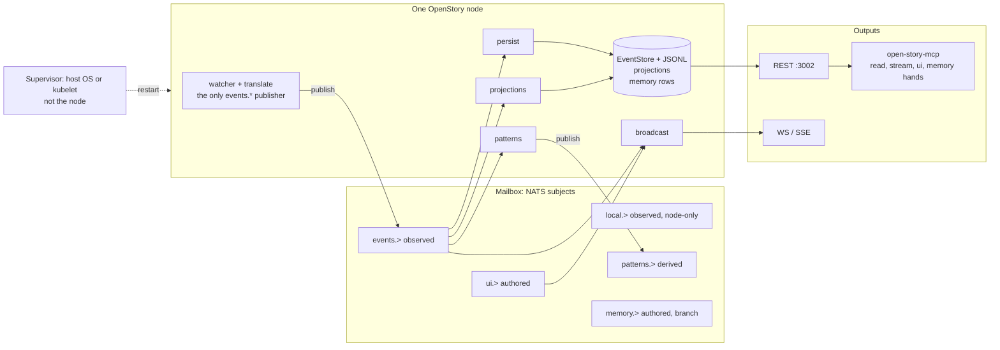
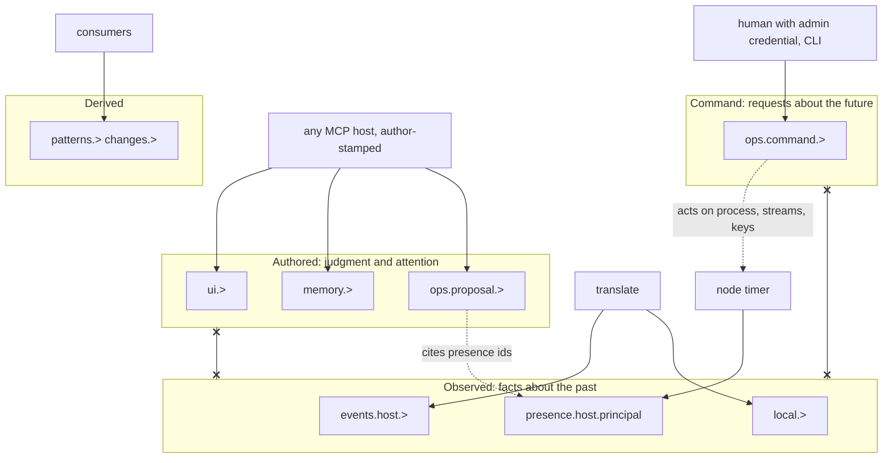

# OpenStory as a node: an actor-shaped mirror that watches itself

**Date:** 2026-09-23
**Status:** research spike. Exploratory. Open threads are the point.
**Thread:** `docs/research/openstory-as-node/`
**Question:** what does it mean for one OpenStory instance to be a node in a distributed system, actor-like, able to report its own health over the MCP, own its state and memory, and run in any host shape from a laptop on a tailnet to a sealed sandbox to a K3s cluster?

The idea is already in the record. This note pulls it together from five sessions, the code on this branch, two sibling research threads, and three operational failures the owner has lived through.

---

## 1. The claim

An OpenStory instance is already shaped like an actor, in the Hewitt sense: it has an address, a mailbox, private state, and a behavior that consumes messages and emits new ones. The mailbox is the set of NATS subjects it subscribes to (`events.>`, `local.>`, `patterns.>`, `ui.>`, and on the memory-hands branch `memory.>`). The state is the durable `EventStore` plus the JSONL backup, the in-memory `SessionProjection` read model, the pattern state machines, and the `memory.*` rows once they land. The behavior is the four consumer actors in `rs/server/src/consumers/` (persist, patterns, projections, broadcast), each a tokio task with its own failure domain. The address is `events.{host}.>` on the bus and `{host}:3002` over HTTP, stamped with a `person_id` and `principal_id` from the `[person]` section of `rs/server/src/config.rs`. What it does not have is a supervisor. The consumers are independent tasks, but nothing inside the process restarts a dead one, and the managed NATS child in `rs/cli/src/managed_nats.rs` is killed on drop but never relaunched if it dies on its own. Supervision today is the host: `brew services`, `systemd`, `restart: unless-stopped`, or a kubelet. That gap is the subject of section 3.

The node is not three things. It never calls a model; hands are verbs the store exposes and the connected host supplies judgment, so the node holds no API key (session `b0a56730`, event `a9c64a25`: "A hand in your vocabulary is a verb the store exposes; the brain is whatever host is connected"). It never writes `events.*`; only translate publishes there, and `HttpEventStore::insert_event` in the MCP is a hard error. And it never interferes with the agents it watches. Principle 1 in `CLAUDE.md` constrains everything below, including where the node acts on itself.

---

## 2. Responsibilities, in bounded contexts

The owner asked the responsibilities question directly on 2026-09-17: boundaries on the way up should be domain driven design, so what would an OpenStory agent do (session `b0a56730`, event `8832792c`). The answer that session gave is the base layer here (event `c0a12103`): "OpenStory today is one bounded context: **Observation**. Events, turns, sentences, patterns. Rust, deterministic, no model, read-only on the source." It then added Memory, Recall, and Curation above it, and closed with the rule that binds all of them: "They never write to events, never alter another agent's behavior, and never sit in an agent's execution path. Their entire write surface is enrichments, verdicts, proposals, and UI state."

A node adds two contexts that session did not need: Presence and Federation. Sovereignty sits across all of them.

| Context | State it owns | Consumes | Emits | MCP hand over it |
|---|---|---|---|---|
| **Observation** | `EventStore`, JSONL, patterns, projections | transcript files, hooks | `events.>` (translate only), `patterns.>`, `changes.>` | read hands: `session_story`, `search`, `tool_journey`; stream: `subscribe_session` |
| **Memory** | `memory.*` rows keyed by handle and author; provisional and final readings | `patterns.>` arcs and exchanges | `memory.>` | read: `story_*`; stream: `subscribe_arcs`; write: `enrich`, `adjudicate_boundary`, `link_saga`, `propose_keep` |
| **Attention** | `ui.*` interactions, control, annotations, reels | `ui.>` | `ui.>` | `navigate_to`, `ui_control`, `save_reel`, `where_is_user`, `subscribe_ui_state` |
| **Presence** (new) | watcher last-event age, consumer liveness, stream bytes vs cap, leaf connectivity, RSS, projection freshness, session digests | its own counters, NATS `:8222` | `presence.{host}.{principal}` heartbeat (proposed) | `node_health`, `fleet_health`, `subscribe_presence` (proposed) |
| **Federation** | leaf config, hub URL, `publish_sessions`, per-host stream bindings, `events-mirror` sources | `events.{other-host}.>` | its own `events.{host}.>` | `fleet_health` reads convergence; no write hand |
| **Sovereignty** | `[person]`, principals, `local_principal_id`, tokens, keys (future seals) | config | attribution stamps on every event | `get_fleet` today; no key or token hand, by design |

Two things fall out. Every context has read and stream hands. Only Memory and Attention have write hands, both to authored subjects. Presence follows the same rule: its write hand is a proposal, not an action, as Curation's "output is a proposal, never an action" in event `c0a12103`.

The monadic framing from the same session is why the split is clean: determinism, then intelligence mapped over it (session `b0a56730`, prompt at 2026-09-17T23:34). The build note's three disciplines (event `d95a4bfe`): "The folds are the functor's structure. Pure Rust, tested by goldens and property tests. The host is a map over the stream. The write hands are the bind back into the store." Presence is one more fold, over the node's own counters. The host may map judgment over it. The bind goes to a proposal subject, never to the process.

---

## 3. Self-monitoring through the MCP

### What signals exist today

More than the backlog suggests, less than a fleet needs.

- `GET /health` (`rs/server/src/router.rs:63`): `status` and `role`. Liveness only.
- `GET /api/health` (`node_health`, `rs/server/src/api.rs:302`): store backend, session count, `bus.connected`, projection count with a `fresh` flag, watcher actor count. This is v1 of `docs/research/node-and-network-health.md`.
- `GET /api/watchers` (`WatcherSnapshot`, `rs/server/src/watcher_diagnostics.rs:69`): `last_event_at`, backfill, counters. Age is derivable, not reported.
- `session_digests` and `fleet::diff_digests` (`rs/server/src/fleet.rs:68`): the per-session event-id digest the health note says unifies `verify` and convergence.
- `rs/server/src/metrics.rs`: `events_ingested_total`, `watcher_last_event_timestamp_seconds`, `watcher_publish_failures_total`, `sessions_active`, `ws_clients_connected`, projection cache gauges. Off by default.
- `rs/server/src/admin.rs` parses NATS `/leafz`; the managed leaf config (`rs/cli/src/managed_nats.rs:152`) opens `http_port: 8222`, so `/varz`, `/jsz`, `/leafz` exist on every managed node.

### What is missing

Stream bytes against the 1 GB `EVENTS_MAX_BYTES` cap (`rs/bus/src/nats_bus.rs:530`). Leaf connectivity in `/api/health`. Consumer lag per consumer actor. Ingest latency. Process RSS. Watcher last-event age as a number. Any heartbeat another node can subscribe to. `GET /api/fleet` returns the person and principals, not fleet health; the network half of the health note is designed and not built. None of it is exposed as an MCP hand.

Each of the three failures in the owner's notes was a missing Presence signal. The hub NATS crash-looped at 512 MB and cut off the fleet; the July session found the cause: "it was open-story itself crash-looping and re-flooding NATS over and over, so JetStream kept re-buffering the same storm until it blew the 512M cap" (session `917baaad`, event `769ab9a3`), and the growth risk: "it holds the whole fleet's projections in memory (3.1G for 2322 sessions)". A month later: "The hub tier is the current failure point. It's OOM-crash-looping at 512MB today and taking the fleet's continuity with it" (session `3e73ef43`, event `ffb1d800`). RSS, restart count, and stream bytes would have shown all of it. The deploy script clobbering box-only fixes is config drift; the node could report a digest of its running config. OpenActor's `agent = "openactor"` events being dropped is a translate-rejection counter that does not exist; `AgentPayload` in `rs/core/src/event_data.rs:217` still has five variants and no `serde(other)`, so the drop is live.

### The doctrine question, and a position

A host model reading health over the MCP may already steer the mirror through `ui.*`. May it restart a consumer, resize a stream, rotate a token?

Principle 1 is about the source, and the node's own body is not the source, so acting on itself does not break the letter. Two facts still argue for restraint. The hub crash loop shows a node acting on itself amplifies: the restarting process was the storm. And the node's own events ride the same bus as everyone's history, so a model acting on infrastructure closes the loop the owner warned about in section 5.

Position: three tiers, and the MCP stops at the second.

| Tier | Acts on | Examples | Who | Via |
|---|---|---|---|---|
| 0 read | nothing | `node_health`, `fleet_health`, `subscribe_presence` | any host | MCP hand |
| 1 derived state | the node's own read model, idempotently | `reproject`, `verify`, `catch-up`, `prune` from `docs/research/state-management-interface.md` | any host, author-stamped, rate-limited, recorded on `ops.>` | MCP hand |
| 2 substance | process, streams, keys, topology, watched paths | restart a consumer, resize `events`, rotate a token, change `nats_leaf_url` | a human holding the admin credential | CLI or service manager, never MCP |

The line: the MCP may change what the node derives, never what the node is or what it watches. Tier 1 is safe because each verb is a set operation over stable event ids; twice equals once. Tier 2 is the host's supervision domain and where fleet-wide effects live. There the node emits a proposal on `ops.proposal.*` with evidence attached, and a person acts. The trust note says the same of sentinels: "They read, they never actuate the observed plane" (`~/projects/openstory-research/trust/notes/2026-09-19-trust-boundaries-and-seals.md`, section 4).

---

## 4. Host shapes

The shapes differ in where the store and NATS live and in what the node's health hand can see. `memory.*` replicates the way `ui.*` does today: it is an authored stream, and federation of authored streams is separate from `events.*` per the backlog note on the interaction seam.

| Shape | Store | NATS | `memory.*` replication | Failure modes | Health hand reports |
|---|---|---|---|---|---|
| Linux service (`systemd`, `brew services run`) | `{data_dir}/open-story.db` + JSONL on local disk | managed child, loopback, from `managed_nats.rs` | none (single node) | child NATS dies and is not relaunched; disk fills; fd limit (commit `019129e`) | watcher age, stream bytes, RSS, projection fresh; `bus.connected` false when the child is gone |
| Docker compose | named volume | `nats` service, loopback network | none, or leaf if `nats_leaf_url` set | container memory limit (the 512 MB and 4 GB lessons); `restart:` loops that re-flood | restart count from `/proc` uptime, stream bytes vs cap, projection cache bytes |
| Single K8s pod | PVC | sidecar container, same netns | none | pod eviction under memory pressure; PVC lost on reschedule if not retained; liveness probe on `/health` only | readiness should be `/api/health` `fresh`, not `/health` |
| K3s cluster, one NATS leaf per node | one PVC per node, each a full mirror | one leaf per node as a Pod sidecar per `docs/research/tailnet-federation/KUBERNETES.md` option (a); hub in-cluster | via the hub, authored streams sourced separately | JetStream stream binding mismatch across versions; leaf reconnecting over a non-tailnet path (the `advertise` fix) | leaf connected, convergence digest ahead/behind per peer, hub stream bytes |
| Distributed K8s with hub (Hetzner or any VPS) | hub holds the aggregate, leaves hold mirrors | hub `:7422` over Tailscale, leaves via managed leaf config | via the hub | hub OOM cut off the fleet; `deploy.sh` clobbered box-only fixes; hub projections grow with the fleet | hub RSS and 79 percent style headroom, config digest drift, per-leaf last-seen |
| Sealed sandbox (arena, `feat/arena-v1`) | per-user volume inside the sandbox | `open-story serve --manage-nats`, loopback, inside gVisor | none in v1; phase 2 is a per-sandbox leaf to an event-wall hub | no egress, so no external anchor; sandbox can still reach the host's Docker bridge gateway (residual in `arena/README.md`); TTL reaper kills the node | must work with zero network: store, watcher age, RSS only; `bus.connected` local |
| Laptop on a tailnet | local disk | managed leaf to hub over Tailscale | via the hub when connected | sleep and wake drop the leaf; "computer went to sleep mid-response" appears five times in session `b0a56730`; catch-up storm on wake | leaf connected, ahead/behind vs hub, watcher age, last wake |

Two invariants hold across rows. JSONL is always on local disk, so the escape hatch does not depend on the shape. And the sandbox row shows the health hand must be honest offline: a node with no bus is solo, not unhealthy, and `/api/health` should say which.

---

## 5. The command and event tension

The owner drew this line on 2026-08-22. First the pull toward actors: "I do think the fundamental physics of creating agent harnesses that have actor system primitives is an interesting idea and related here, in that agents will be able to stream openstory events from other agenets, and work in concert in this fashion... which is the ying to the yang of OpenStory" (session `3e73ef43`, event `42acd3ce`). Then the warning: "yea... there are some serious tensions there and will need strong boundaries... a cloudevent that is a command or presents an actor system primitive... that is a wholely different thing" (event `8a9d7682`).

The assistant's two replies are the design constraints. On the loop: "If agent A acts on B's events and B acts on A's, you've closed a loop through the observation layer. The record is no longer a mirror; it's part of the control system" (event `45418490`), with the fix of causation and correlation ids as CloudEvents extensions so closed-loop sessions are marked and filterable. On the category: "A command is a request about the future that can be refused. Putting them on one bus collapses the distinction that makes the observation layer safe to trust. Different subject namespace at minimum, and arguably a different stream" (event `41e774e6`).

A self-supervising node makes this concrete: its health is history, its proposals are requests about the future. They must not share a family.

| Family | Kind | Who may publish | Federates | Persisted where |
|---|---|---|---|---|
| `events.{host}.>` | observed history | translate step only | yes, per-host binding | `EventStore`, JSONL |
| `local.>` | observed history, kept home | translate step when `publish_sessions = false` | never | `EventStore`, JSONL |
| `patterns.>`, `changes.>` | derived | patterns and projections consumers | with events | patterns table |
| `ui.>` | authored attention | server on `POST /api/control` from any host, author-stamped | separately | `ui` stream |
| `memory.>` | authored judgment | server on `POST /api/memory` from write hands, author-stamped | separately | memory rows (branch) |
| `presence.{host}.{principal}` (proposed) | observed, about the node | the node itself, on a timer | yes, interest-based like `changes` | not in `EventStore`; a ring buffer, and Prometheus if enabled |
| `ops.proposal.>` (proposed) | authored request | any host via a Presence write hand, author-stamped, carries evidence ids | no by default | ops log |
| `ops.command.>` (proposed) | command | a human-held admin credential only, never the MCP | never | ops log |

The rule: nothing authored or command may publish into an observed family, and presence is observed because it is a fact, not a request. The audit in section 7 checks this by construction. Each `ops.proposal` cites the `presence` event ids it reasoned from: the causation id the strategy session asked for, applied to the node.

---

## 6. Relationship to OpenActor

The Grok session settled the vocabulary. The owner: "subagents are kinda pointing towards actor system primitives, but are not. really, an 'agent actor' is not a 'coding harness', though it may be an 'agent harness'" (session `019fdb37`, event `019fdb37-f1a0-7973-b489-99f5b0e7aaea-8795`). The assistant: "You're drawing the right seams. They're related by nesting, not by identity" (event `…-10484`), and drew four layers: actor primitive, agent actor, agent harness, coding harness. The same session defined the sibling project: "OpenActor (as you mean it) = actor primitives + evented agent harness" with two spines, "uniform actor runtime and native OpenStory event stream as the recursion" (event `…-6989`). On native emit it also fixed the direction: "Keep ACP as Grok's canonical log; OpenStory is a projection, not the session DB" (event `…-2825`).

Position: the OpenStory node is an actor in OpenActor's runtime sense and not an agent actor. Event `…-10484` names the category: a "window fold" or a "retry supervisor" is still an actor; only some actors are agentic. The node has a mailbox, state, and a behavior, and the behavior is a fold. It has no policy, goal, or model, and must never gain one, or its own history stops being a clean observation. So OpenActor is the runtime and the harness; OpenStory is the memory organ that folds what the harness emits; and a node dropped into an OpenActor fleet is a non-agentic fold actor a supervisor may restart but not instruct. Restart is tier 2 and belongs to whoever runs the fleet.

Five things have to hold in code.

1. `AgentPayload` tolerates `openactor` and any future harness, raw preserved. The strategy session already said it: "OpenStory's `agent` enum still doesn't tolerate `"openactor"`, so the bus consumer drops those events. The yin can't hear the yang yet" (event `45418490`).
2. OpenActor's `harness.actor crashed→restarted` trace lands as observed events, so supervision is on the record.
3. The node emits `presence.*` as one of the person's principals: the trust note's sentinel model applied to the mirror.
4. Causation and correlation ids on the envelope mark closed loops through the bus.
5. The only inbound command path is `ops.command.>` from a human credential. If OpenActor supervises the node, it holds that credential the way a kubelet holds the restart right, and nothing more.

---

## 7. Experiments, cheapest first

Each is a day, each produces a file, none is a product.

1. **`scripts/node_health_probe.py`.** Read `/health`, `/api/health`, `/api/watchers`, and NATS `:8222/varz`, `/jsz`, `/leafz` on a running node. Compute watcher last-event age in seconds, `events` stream bytes as a fraction of the 1 GB cap, leaf connected, and process RSS from `/proc` or `ps`. Print a one-screen presence card. `--test` runs against captured fixtures, including the real `/leafz` JSON already in `rs/server/src/admin.rs:792`. Answers: what does `/api/health` need that it does not have, with numbers from this machine's node.
2. **`rs/core/tests/agent_payload_tolerance.rs`.** Red test: a CloudEvent with `agent: "openactor"` survives deserialization as an `Unknown` variant with `raw` intact and reaches the persist consumer. Green: `#[serde(other)]` or an explicit `Unknown(Value)` arm on `AgentPayload`, plus a translate-rejection counter in `metrics.rs`. Answers: the yin can hear the yang, and the drop count is a visible Presence signal.
3. **`scripts/subject_publishers.py`.** Static audit: find every `publish(` and stream declaration in `rs/`, map subject prefix to publishing module, and emit the who-may-publish table from section 5 as data. Fail if any module outside translate publishes to `events.` or `local.`, or if any MCP tool reaches a subject not in the authored set. `--test` on a synthetic tree. This is the soul-invariant test, and it is the pre-condition for adding `presence.*` and `ops.*` without opening a hole.
4. **`rs/tests/test_stream_cap_wedge.rs`.** Testcontainers, `#[ignore]` like the leaf tests. Boot a node with a tiny `events` cap, flood past it, assert `/api/health` reports bytes over cap and flips `status` before ingest wedges. Repeat with a memory limit small enough to OOM on reproject. Answers: would the mirror have reported the hub failure before the fleet went dark, and what the backlog's yellow-then-red indicator keys on.

---

## 8. Open threads and what I could not verify

- **Supervision of the managed NATS child.** `ensure_nats` waits 15 seconds for reachability and returns a guard; nothing notices the child dying later. Whether `bus.connected` flips false or the consumers hang is untested.
- **`/api/fleet` versus the health note.** The note designs it as network health; the code serves person and principals. The digest endpoint exists; nothing calls it across nodes yet.
- **Arena is not on this branch.** I read `arena/README.md`, `arena/deploy/docker-compose.yml`, `arena/sandbox/skel/mcp.json`, and the spec via `git show` on `feat/arena-v1` and `docs/arena-spec`. The sandbox row in section 4 is from that reading, not from running it.
- **`memory.*` is on `feat/memory-hands` only.** The stream declaration at `rs/bus/src/nats_bus.rs:263` and `rs/server/src/memory_api.rs` exist in that worktree, not here. How an authored stream federates is designed in the backlog and not implemented for `memory` anywhere I could see.
- **Presence as a principal's ledger.** The trust note wants sentinel histories sealed and witnessed. Whether node heartbeats should be sealed, or are too high-volume for a per-arc seal, is open. A ring buffer plus a sealed hourly digest is one answer.
- **The deploy clobber.** I have the owner's note that `deploy.sh` overwrote box-only fixes. I did not find the script or the fix in this worktree, so the config-digest signal in section 3 is inferred from the failure, not from a diff.
- **Whether a model over MCP should ever run tier 1.** `reproject` on the hub is the operation that produced the boot storm. A rate limit is not a proof; the stream-cap test is the first evidence.
- **OpenActor's supervision API.** I relied on the Grok session's account of `harness.actor crashed→restarted` and `ADR-001`; I did not open the OpenActor repo.

---

## Sources

**Sessions and events (OpenStory store, via MCP and `GET /api/sessions/{id}/records`)**

- `b0a56730-8328-4713-89d5-339df65fe2e2` (2026-09-17 to 20): events `8832792c-e1f5-4700-850d-0bcf453ceea3` (responsibilities prompt), `c0a12103-17e9-42a2-9aa4-59ba9568dc01` (bounded contexts and the two agents), `a9c64a25-b254-4b30-b892-d9eb766830f5` (hands, no API key), `d95a4bfe-a8e9-4e01-8896-92eb8b198bba` (functor, map, bind), `22a2d7e4-e156-4c2f-be18-f60269325cff` (three senses of agent); prompt timeline entry at 2026-09-17T23:34 for the monadic framing.
- `dbcc2146-835c-4290-a983-08cf67a0deb7` (2026-09-19 to 20): events `95489aec-7bac-4914-892c-e612c2fbc529` (the spring prompt), `bdca5835-d029-498f-b56f-b65b855ab8ed` (synthesis), `d42eaa02-fd54-4b31-86d6-cfe704f82b2d` (three sealed architectures A, B, C).
- `019fdb37-f1a0-7973-b489-99f5b0e7aaea` (Grok, 2026-08-07 to 09-07): events `…-983`, `…-2825` (native emit levels), `…-6989` (OpenActor spines), `…-8795` (subagents and actors), `…-10484` (four seams).
- `3e73ef43-975b-42af-b311-04c4401aff5d` (2026-08-09 to 28): events `42acd3ce-aea2-42ea-80fd-8e003a81a3c4`, `8a9d7682-6d38-4e81-9acd-a3fa6347c122` (the tension), `45418490-9a01-47b6-84e0-7685d88998dc` (closed loop, causation ids, enum drop), `41e774e6-a2f9-475f-a161-7aef1c63eaa6` (event versus command), `ffb1d800-aa41-4846-9305-906fd43298e6` (hub as failure point).
- `917baaad-5bf7-4e16-9329-e0f2331724dd` (2026-07-08 to 16): events `6ce70262-136b-42ac-a8f3-7730f0cb8a69`, `769ab9a3-82b4-4a3f-98ef-39aaec80b49b` (crash loop cause, 3.18 GiB), `73343c69-38f9-4309-96c3-6d670002c26e`, `808b38c6-a052-4d06-af83-5fc3ae203df3`.

**Files in this worktree (`feat/reel-chart-beats-kindle`)**

`CLAUDE.md`; `docs/soul/architecture.md`; `docs/soul/sicp-lessons.md`; `docs/deploy/distributed.md`; `docs/research/tailnet-federation/RESULTS.md`; `docs/research/tailnet-federation/KUBERNETES.md`; `docs/research/node-and-network-health.md`; `docs/research/state-management-interface.md`; `docs/BACKLOG.md` ("The mirror reports on itself"); `rs/cli/src/managed_nats.rs`; `rs/server/src/config.rs`; `rs/server/src/metrics.rs`; `rs/server/src/api.rs` (`node_health`, `session_digests`, `get_fleet`); `rs/server/src/router.rs`; `rs/server/src/watcher_diagnostics.rs`; `rs/server/src/fleet.rs`; `rs/server/src/admin.rs`; `rs/bus/src/nats_bus.rs`; `rs/core/src/event_data.rs`; `rs/mcp/src/lib.rs`, `rs/mcp/src/tools/mod.rs`, `rs/mcp/src/tools/control.rs`, `rs/mcp/src/subscription.rs`, `rs/mcp/src/nats_bus.rs`.

**Files on other branches, read with `git show` only**

`feat/arena-v1`: `arena/README.md`, `arena/deploy/docker-compose.yml`, `arena/sandbox/skel/mcp.json`. `docs/arena-spec`: `docs/superpowers/specs/2026-08-25-arena-sealed-sandboxes-design.md`. `feat/memory-hands` worktree: `rs/bus/src/nats_bus.rs`, `rs/server/src/memory_api.rs`, `rs/mcp/src/tools/memory_write.rs` (grep only).

**Sibling research repo (read-only)**

`~/projects/openstory-research/memory/notes/2026-09-17-memory-hands.md`; `~/projects/openstory-research/memory/notes/2026-09-17-memory-hands-build.md`; `~/projects/openstory-research/memory/notes/2026-09-18-mcp-intelligence-map.md`; `~/projects/openstory-research/trust/notes/2026-09-19-trust-boundaries-and-seals.md`.

**Owner's notes (memory)**

Hub NATS 512 MB OOM crash loop and fleet-wide cutoffs; `deploy.sh` clobbering box-only fixes; OpenActor `agent = "openactor"` dropped by the enum; local store cold-boot cost.
