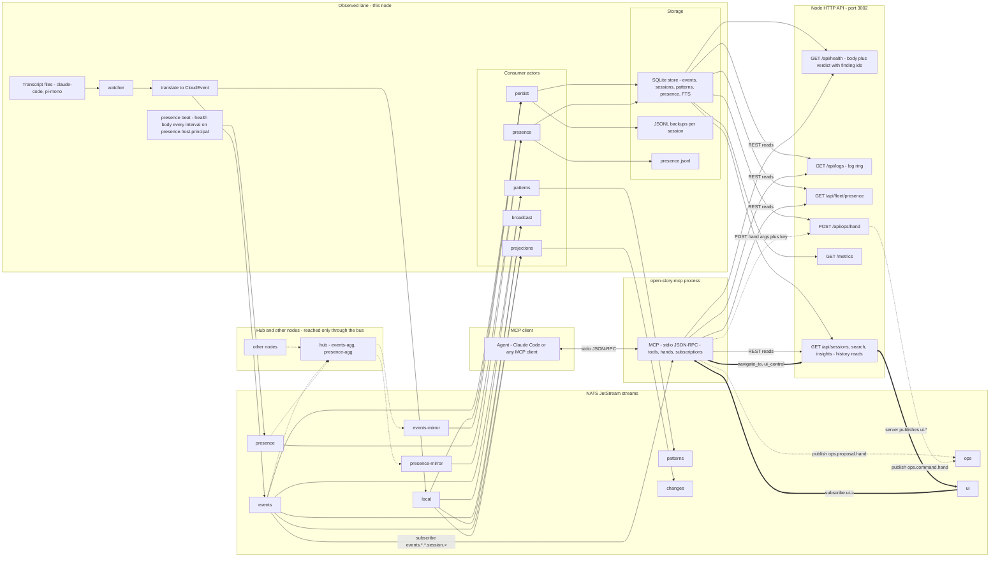
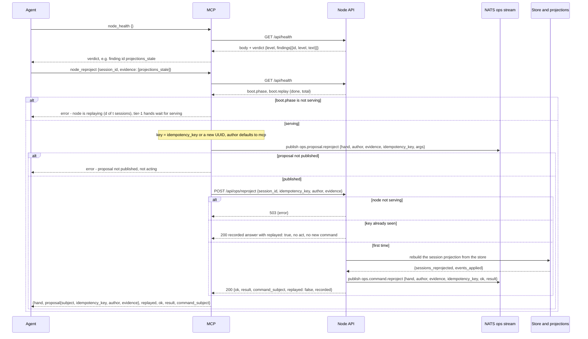

# The ops MCP — where it sits and what it does

The ops MCP is the group-M surface of `open-story-mcp`: a stdio JSON-RPC process
that an agent (Claude Code or any MCP client) talks to, and that reads the node
it is pointed at through the REST API (`OPENSTORY_API_URL`) and the bus
(`OPENSTORY_NATS_URL`). Its rule, verbatim from `rs/mcp/src/protocol.rs`
(`TIER_RULE`): **"Tier 0 hands read; tier 1 hands change only what is derived
and leave a proposal on the bus; tier 2 is a proposal a person or the host
carries out."** The sovereignty line is enforced at the subject layer: the MCP
reads observed history, publishes only `ops.proposal.>` and `ui.>`, and never
`events.*` (M-08 enumerates every publish call in `rs/mcp` and asserts the
prefix). The node's own verdict, not the agent's, is the source of evidence:
every proposal cites finding ids that `/api/health` produced.

Sources: `rs/mcp/src/tools/{mod,ops}.rs`, `rs/mcp/src/{protocol,stdio,subscription,nats_bus}.rs`,
`rs/server/src/{ops,presence,node_health}.rs`, `rs/core/src/ops.rs`,
`rs/bus/src/nats_bus.rs` (`ensure_streams`), spec §7–9, REQUIREMENTS group M.

## View 1 — where the MCP sits

Three lanes cross the bus. **Observed** (solid arrows) is what agents wrote and
what the node derives from it; the MCP only reads it. **Authored** (thick
arrows) is `ui.>`: what a person or an agent did on the dashboard. **Ops**
(dotted arrows) is `ops.>`: proposals from the MCP and commands from the node.

What each edge means:

- **Observed.** The watcher reads transcript files and never writes them; translate
  emits CloudEvents to `events.>` (or `local.>` when a session is kept on the
  machine); the consumer actors derive the store, the JSONL backups, patterns,
  and projections. The presence beat is observed too: every interval the node
  publishes the same body `/api/health` serves on `presence.{host}.{principal}`
  and the presence consumer lands it in the `presence` table and `presence.jsonl`,
  never in `events`. Under federation `events-mirror` and `presence-mirror` source
  the hub's `events-agg` and `presence-agg` (or every peer directly, in mesh), so
  another node's history and beats arrive only through the bus.
- **Authored.** `ui.>` carries dashboard interactions the server publishes on behalf
  of a person or an agent. The MCP subscribes to it to live-follow and publishes into
  it only through the server's control endpoints.
- **Ops.** `ops.>` is its own stream (limits-based, 64 MB, 30 days). The MCP writes
  `ops.proposal.<hand>`; the node writes `ops.command.<hand>`. Neither is agent history.

## View 2 — what the MCP does

One tier-1 act, exactly as `tier_one` in `rs/mcp/src/tools/ops.rs` and `run_hand`
in `rs/server/src/ops.rs` do it:

The watch motion is a poll that speaks only on change. `subscribe_health` in
`rs/mcp/src/stdio.rs` reads the verdict once and acks with it, then every
`interval_secs` (default 15) reads again and applies the pure
`health_transition(prev, next)`:

| step | what happens |
|---|---|
| ack | `{stream_id, status: started, interval_secs, verdict}` with the current verdict |
| every tick | `GET /api/health`; take `verdict`; an unreachable node becomes `{level: unknown, findings: [health_unreachable]}`, a body without a verdict becomes `no_verdict` — so an outage is itself a transition |
| compare | sort finding ids of both verdicts; `added` = in next not prev, `cleared` = in prev not next |
| silence | same level and nothing added or cleared: no message |
| notify | otherwise `notifications/openstory/health {from, to, added, cleared, verdict, stream_id, seq}` |
| cancel | `notifications/cancelled` drops the task |

## The hands

| hand | tier | motion | reads or changes | publishes | refuses when |
|---|---|---|---|---|---|
| `node_health {}` | 0 | diagnose | `GET /api/health`: the body plus the node's verdict (level, findings with ids) | nothing | no API base configured |
| `node_logs {since?, actor?, level?, limit?}` | 0 | diagnose | `GET /api/logs` log ring, paged by `next` | nothing | no API base configured |
| `node_streams {}` | 0 | diagnose | `streams[]` of `/api/health`: bytes, messages, max_bytes, percent, level (warn 70 %, critical 90 %) | nothing | no API base configured |
| `fleet_presence {}` | 0 | watch | `GET /api/fleet/presence`: latest beat per node, `age_secs`, `stale` past three beats | nothing | no API base configured |
| `subscribe_health {interval_secs?}` | 0 | watch | polls `/api/health`; emits only verdict transitions | nothing on the bus; JSON-RPC notifications to the client | no API base configured |
| `node_reproject {session_id?, evidence?, idempotency_key?, author?}` | 1 | propose | rebuilds one session's projection from the store, or every session's (derived state only) | `ops.proposal.reproject`; node records `ops.command.reproject` | `boot.phase != serving` (MCP and node both check); proposal publish fails |
| `node_verify {session_id, evidence?, …}` | 1 | propose | counts store events, JSONL lines, FTS documents; `agree` = store equals backup; changes nothing | `ops.proposal.verify`; node records `ops.command.verify` | not serving; missing `session_id` (400) |
| `node_catch_up {peer?, evidence?, …}` | 1 | propose | one digest diff against a peer, pulling sessions this node is missing into the store | `ops.proposal.catch_up`; node records `ops.command.catch_up` | not serving; no peer given and `OPEN_STORY_CATCH_UP_PEER` unset (400) |
| `node_prune {older_than_days, evidence?, …}` | 1 | propose | deletes fleet-mirrored sessions older than N days, never this host's own | `ops.proposal.prune`; node records `ops.command.prune` | not serving; `older_than_days < 1` (400) |
| `restart_consumer`, `resize_stream`, `restart_nats`, `restart_node` | 2 | propose | **no hand; proposal only.** A proposal with evidence ids that a person or the host carries out | `ops.proposal.<name>` | always, as an act: the MCP has no tool that performs these |

Every tier-1 call carries the same three fields: `evidence` (finding ids from
`node_health`), `idempotency_key` (reused to retry safely, generated when
absent), and `author` (default `mcp`). The node answers a seen key with the
recorded result and `replayed: true` without acting again. Finding ids the
verdict can raise: `bus_disconnected`, `leaf_down`, `replaying`,
`projections_stale`, `stream_cap:<stream>`, `consumer_dead:<name>`,
`consumer_restarted:<name>`, `watcher_quiet:<actor>`,
`publish_failures:<actor>`, `presence_failures`.

## What it does not do

- Never publishes to `events.*` or `local.*`. Its only authored subjects are
  `ops.proposal.>` and `ui.>`; a test enumerates every publish in the crate.
- Never restarts anything. Tier 2 (consumers, streams, NATS, the node) is a
  proposal on the bus that a person or the host carries out.
- Never reasons about the content of the coding agents' sessions. The ops hands
  read the node's health, logs, streams, and presence; the history hands read
  what agents wrote, and neither rewrites it.
- Refuses tier-1 acts while the node is not serving. Both the MCP (before
  proposing) and the node (`503` on `POST /api/ops/{hand}`) check `boot.phase`,
  and the refusal names the replay progress.
- Never acts without a proposal. If `ops.proposal.<hand>` cannot be published,
  the hand returns an error and does not call the node.
- Never mutates transcripts, the watcher, or the translator. Tier 1 changes only
  what is derived: projections, mirrored sessions, and what verify merely counts.
