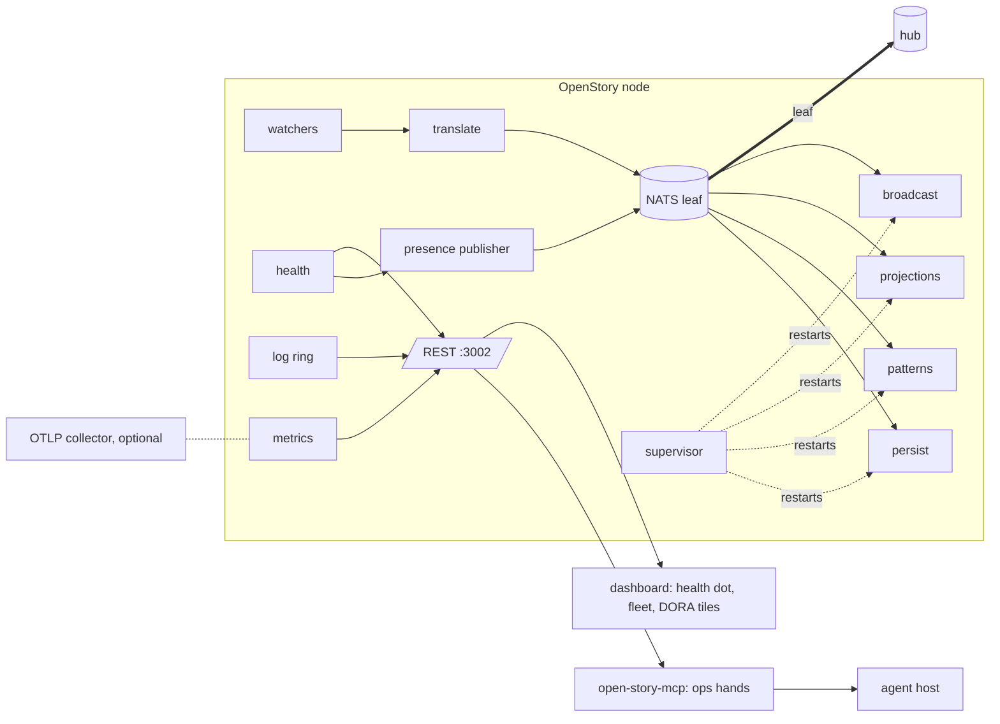

# Node ops: a design for an OpenStory node that watches itself

**Date:** 2026-09-23 · **Status:** design, approved for the node ops loop.
**Owner's ask:** make OpenStory world class in infrastructure tooling, in line
with DORA, with an MCP an agent can use to monitor and drive the health and
management of the architecture in real time.
**Reads with:** the audit `docs/research/openstory-as-node/2026-09-23-logging-and-ops-hands.md`,
the node note `2026-09-23-openstory-as-node.md`, and the scoreboard
`REQUIREMENTS.md` in the same directory. The loop that builds it is
`docs/prompts/node-ops-loop.md`.

## 1. The problem in one paragraph

An OpenStory node today cannot tell anyone it is unwell. Logs are bare prints
with no level or session. The managed NATS child's output is discarded.
Consumers exit silently. The persist consumer drops failed writes on the floor.
The health endpoint reports the bus connected even when it is not. Boot replay
is invisible until it ends. On 2026-09-23 the owner's node ran for hours with
its events stream full and evicting, its leaf disconnected, and thirty three
publish failures, and every signal said fine. A probe script found all of it in
one call. The node should have said it first.

## 2. Principles

1. **Observe, never interfere, applied to the node itself.** The node may
   report on itself and may derive state from what it holds. It may never
   change what it watches. Restarting itself is a host's job.
2. **Three tiers, and the MCP stops at two.** Tier 0 reads. Tier 1 derives
   state through idempotent operations, author stamped, recorded on `ops.>`.
   Tier 2 changes substance (restart, resize, rotate) and is held by a human
   credential or the host supervisor. An agent may propose tier 2 with
   evidence; a person acts.
3. **Health is a fact on the bus.** The node's state is a CloudEvent on an
   observed family, `presence.>`, so the hub, other nodes, the fleet tab, and
   an ops agent all read one thing.
4. **A node is one principal.** One store, one leaf, one pod. Scale is by
   adding nodes, not by replicating a node's ingestion.
5. **Every signal names the change.** Git sha and build time ride on every log
   line, every health response, and every presence event. That is what makes
   DORA measurable from the node's own record.
6. **No vendor in the core.** `tracing` for logs, OpenTelemetry crates for
   metrics and spans, exported over OTLP or Prometheus text. Where the data
   goes is the operator's choice.

## 3. Architecture

What changes: a supervisor around the consumers, a health model that can say
no, a presence publisher, a log ring, real metrics, and read plus derived-state
hands on the MCP. What does not change: the translators remain the only
publishers of history, the store remains one SQLite file plus JSONL, and the
dashboard remains a sink.

## 4. Logging (group L)

Adopt `tracing` and `tracing-subscriber`. Two formatters: the current text
look for a terminal, JSON lines for everything else. Every line carries a
timestamp, level, target, a stable `event` name, and `actor` inside a consumer.
Lines about a session carry `session_id`; lines about a bus message carry
`subject`. The managed NATS child writes to a rotated file under its store
directory. Boot replay reports progress. An in-process ring keeps the last few
thousand lines and serves them at `GET /api/logs`, so an agent can read logs
through the API without shell access. A script boots an isolated scratch node
so nothing in the loop touches the live one.

## 5. Errors and supervision (group E)

No swallowed errors: a static audit fails the build on `let _ =` over a
fallible persist, publish, append, or index. Each failure logs an event and
increments a counter. A supervisor owns the four consumers, restarts one that
exits with exponential backoff, and exposes restart counts through health.
Watcher publish failures are logged with subject and error; the fifteen Grok
failures seen today get root-caused as part of this group. Translate
rejections count by reason. The NATS child's death is noticed within seconds.

## 6. Health (group H)

`GET /health` stays a liveness check: the process is up. `GET /api/health`
becomes readiness and truth: boot phase with replay progress, 503 until
serving; bus connection real; per-stream bytes against caps; per-consumer
alive, restarts, lag; leaf configured and connected; per-watcher age and
failures; version, sha, build time, store size, RSS, uptime. The dashboard
header gets a dot with the JSON one click away.

## 7. Presence (group P)

Every fifteen seconds the node publishes its health as a CloudEvent on
`presence.{host}.{principal}`. It is an observed family: the persist consumer
stores it in its own table, never in events. `GET /api/fleet/presence` returns
the latest per node with staleness. The leaf and hub configs carry
`presence.>` alongside `events.>`. The fleet tab reads presence, and the local
node reads its own presence through the same path.

## 8. Telemetry (group O)

Metrics on by default at `/metrics` in Prometheus text: events ingested by
agent, consumer lag, stream bytes, consumer restarts, publish failures. An
optional OTLP endpoint exports the same metrics and a sampled span per event
from translate through persist. Unset means no socket opened. One Grafana
dashboard, "Node", replaces the March ones. PR #46 is closed in favour of this.

## 9. Ops hands on the MCP (group M)

| Tier | Hand | What it does |
|---|---|---|
| 0 | `node_health` | health JSON plus verdict and findings, computed like the probe |
| 0 | `node_logs` | the log ring, filtered by actor, level, since |
| 0 | `node_streams` | bytes against caps, percent |
| 0 | `fleet_presence` | latest presence per node with staleness |
| 0 | `subscribe_health` | notifications on verdict transitions and findings |
| 1 | `node_reproject` | rebuild one session's projection from the store |
| 1 | `node_verify` | check store, JSONL, and FTS agree for a session |
| 1 | `node_catch_up` | replay the bus window since a sequence into the store |
| 1 | `node_prune` | apply the retention policy now |
| 2 | none | `ops.proposal.restart_consumer`, `resize_stream`, `restart_nats`, `restart_node` are proposals with evidence ids, executed by a person or the host |

Tier 1 hands publish `ops.proposal.<hand>` with author, evidence, and an
idempotency key, call the matching REST endpoint, and the server records
`ops.command.<hand>` with the result. They refuse while the node is not
serving. A test enumerates every publish in the MCP crate and asserts the
prefix is `ops.proposal.` or `ui.`. Motions for the help text: **watch**
(subscribe_health, fleet_presence), **diagnose** (node_health, node_logs,
node_streams), **propose** (tier 1 hands, and tier 2 proposals with evidence).

An agent using these hands can watch a node in real time, explain a critical
in plain words with the evidence, fix what is derived, and hand a person a
proposal for what is not. That is the whole of "monitor and drive" that the
soul allows, and it is enough.

## 10. Kubernetes shape (group K)

One pod is one node is one principal: the production image plus a NATS leaf
sidecar in the same network namespace, the store and JetStream on persistent
volumes, config from a ConfigMap, the leaf URL from a Secret, logs to stdout
as JSON. Probes: liveness on `/health`, readiness on `/api/health`, and a
startup probe generous enough for a cold replay. A single Deployment never
sets replicas above one; a manifest check refuses it. Two principals are two
Deployments. An optional ops-agent pod runs the MCP against the node's
Service with no service account token. Tier 2 belongs to the kubelet or a
small operator watching presence, never the same pod as the ops agent.
Experiments run on a1 in `os-loop-` namespaces and are torn down each task.
A testcontainers test floods a tiny stream cap and proves health flips before
ingestion wedges, and that the NATS child's death is noticed under a memory
limit.

## 11. DORA (group D)

The four keys, measured from the node's own record and git:

| Key | Source |
|---|---|
| Deployment frequency | distinct git shas seen in presence per day |
| Lead time for changes | commit time to first presence carrying that sha |
| Change failure rate | share of shas whose first hour of presence contained a critical |
| Time to restore | critical to ok duration in presence |

The health probe is the deploy gate: a new sha does not roll while the running
node is critical, and rolls back if it is critical after its startup window.
Rollback is a one-liner per host shape, documented and tried once on a1. The
numbers appear as four tiles on the Admin tab.

## 12. Order of work and estimates

| Group | Days | Why this order |
|---|---|---|
| L logging | 3 | everything after it needs to be seen |
| E errors and supervision | 2 | stops silent death |
| H health | 1.5 | readiness for K, input for P and M |
| P presence | 2 | the fact everyone reads |
| O telemetry | 1.5 | export of what H and P already compute |
| M ops hands | 2 | the agent's eyes and derived-state hands |
| K Kubernetes | 2 | manifests, a1 run, wedge test |
| D DORA | 1 | scripts and tiles over P and H |

About fifteen days of work. The loop takes them in this order, one row at a
time, red first. Eight hours should carry it through L and most of E.

## 13. Out of scope

- Any tier 2 action on the MCP.
- A logging or metrics vendor in the core.
- Replicating a single node's ingestion.
- Raising the live node's stream cap (owner's decision; three PRs exist).
- Hub-side changes beyond noting what `openstory-deploy` must carry (`presence.>`).
